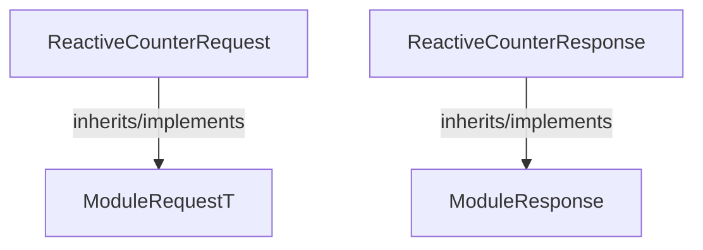

<!-- hash: 6638704a4b2039861caa2ede4dd1b2eb -->
# Request Documentation

This document details the purpose and relations of the components in `/GameModuleDTO/Sample/ReactiveModule/Request`.

## Component Overview

### `ReactiveCounterRequest` (class)
- **Description**: Sample implementation managing reactive parameter commands execution blocks.
- **Namespace**: `GameModuleDTO.Sample.ReactiveModule`
- **Inherits/Implements**: `ModuleRequestT<ReactiveCounterResponse>`
- **Properties**: `Value`
- **Methods**: `AssertModule`

### `ReactiveCounterResponse` (class)
- **Description**: Sample payload returning active state changes for reactive components.
- **Namespace**: `GameModuleDTO.Sample.ReactiveModule`
- **Inherits/Implements**: `ModuleResponse`
- **Properties**: `Value`
- **Methods**: `IsValid`

## Dependency & Behavior Schema

[Back to Parent](../ReactiveModuleRead.md)
