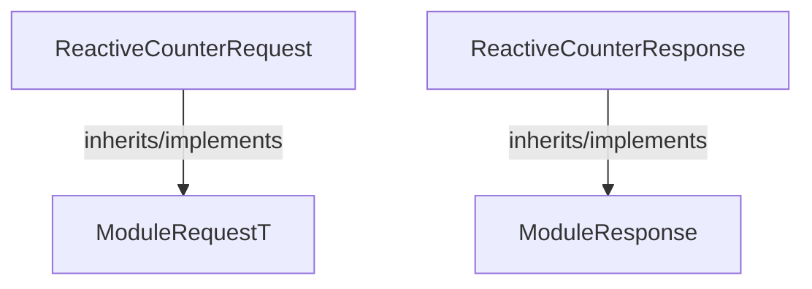

<!-- hash: d9bc4510e7c48e78978de2c0435deefe -->
# Request Documentation

This document details the purpose and relations of the components in `/Sample/ReactiveModule/Request`.

## Component Overview

### `ReactiveCounterRequest` (class)
- **Description**: Represents a data payload for a reactive counter request sent to the server. Contains parameters required to execute the request.
- **Namespace**: `GameModuleDTO.Sample.ReactiveModule`
- **Inherits/Implements**: `ModuleRequestT<ReactiveCounterResponse>`
- **Properties**: `Value`
- **Methods**: `AssertModule`

### `ReactiveCounterResponse` (class)
- **Description**: Represents the server's response to a reactive counter request. Contains the result data.
- **Namespace**: `GameModuleDTO.Sample.ReactiveModule`
- **Inherits/Implements**: `ModuleResponse`
- **Properties**: `Value`
- **Methods**: `IsValid`

## Dependency & Behavior Schema

[Back to Parent](../ReactiveModuleRead.md)
