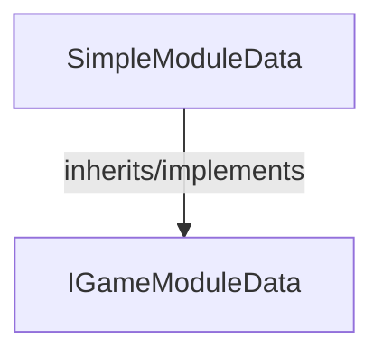

<!-- hash: 1d5825c122a3d8e2f8216f72b7f3c23b -->
# SimpleModule Documentation

This document details the purpose and relations of the components in `/Sample/SimpleModule`.

## Sub-Modules

- [Request](Request/RequestRead.md)

## Component Overview

### `SimpleModuleData` (class)
- **Description**: Data container holding state and properties for simple module data.
- **Namespace**: `GameModuleDTO.Sample.SimpleModule`
- **Inherits/Implements**: `IGameModuleData`
- **Properties**: `Key`

## Dependency & Behavior Schema

[Back to Parent](../SampleRead.md)
