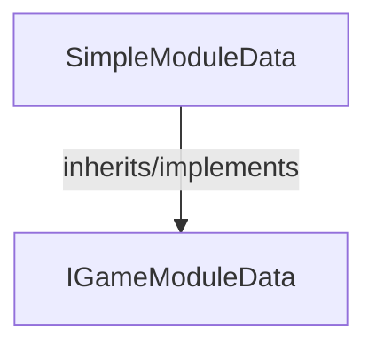

<!-- hash: 2ae6b04837a4d95c2e41284c2677965c -->
# SimpleModule Documentation

This document details the purpose and relations of the components in `/GameModuleDTO/Sample/SimpleModule`.

## Sub-Modules

- [Request](Request/RequestRead.md)

## Component Overview

### `SimpleModuleData` (class)
- **Description**: Represents an empty sample payload for simple structural tests natively.
- **Namespace**: `GameModuleDTO.Sample.SimpleModule`
- **Inherits/Implements**: `IGameModuleData`
- **Properties**: `Key`

## Dependency & Behavior Schema

[Back to Parent](../SampleRead.md)
