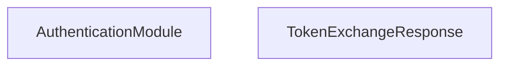

<!-- hash: aacd6fa7af480e1b49d4d7f4faf2bccc -->
# Authentication Documentation

This document details the purpose and relations of the components in `/Core/Authentication`.

## Component Overview

### `AuthenticationModule` (class)
- **Description**: A core game module responsible for managing authentication module logic and state within the game.
- **Namespace**: `GameModule.Authentication`

### `TokenExchangeResponse` (class)
- **Description**: Represents the server's response to a token exchange request. Contains the result data.
- **Namespace**: `GameModule.Authentication`

## Dependency & Behavior Schema

[Back to Parent](../CoreRead.md)
