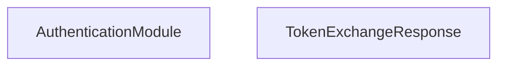

<!-- hash: 58e8ad409c7c02806e619272e422d3c7 -->
# Authentication Documentation

This document details the purpose and relations of the components in `/Project/Core/Authentication`.

## Component Overview

### `AuthenticationModule` (class)
- **Description**: Manages Unity Cloud authentication and token exchange mechanisms.
- **Namespace**: `GameModule.Authentication`

### `TokenExchangeResponse` (class)
- **Description**: Deserializes the response payload mapping incoming API tokens securely.
- **Namespace**: `GameModule.Authentication`

## Dependency & Behavior Schema

[Back to Parent](../CoreRead.md)
