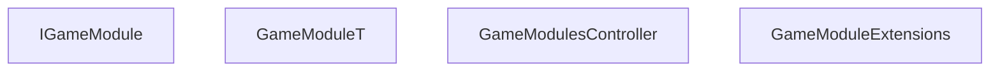

<!-- hash: 68efbc6d0465df4a7813c3ede9f837d1 -->
# GameModule Documentation

This document details the purpose and relations of the components in `/Core/GameModule`.

## Component Overview

### `IGameModule` (interface)
- **Description**: A core game module responsible for managing igame module logic and state within the game.
- **Namespace**: `GameModule.GameModule`
- **Properties**: `Client`, `Server`, `Key`
- **Methods**: `Initialize`

### `GameModuleT` (class)
- **Description**: Handles core data and operations for game module t within the architecture.
- **Namespace**: `Global`
- **Properties**: `Client`, `Server`, `Key`
- **Methods**: `Initialize`

### `GameModulesController` (class)
- **Description**: Controller class that orchestrates game modules controller behavior and manages dependencies.
- **Namespace**: `GameModule.GameModule`

### `GameModuleExtensions` (class)
- **Description**: Provides utility extension methods for game module extensions.
- **Namespace**: `GameModule.GameModule`

## Dependency & Behavior Schema

[Back to Parent](../CoreRead.md)
