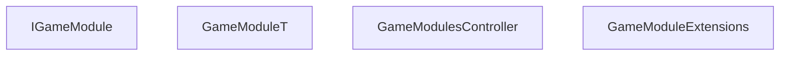

<!-- hash: 85eb53cc2352fe28b8ade2b4b5841b8c -->
# GameModule Documentation

This document details the purpose and relations of the components in `/Project/Core/GameModule`.

## Component Overview

### `IGameModule` (interface)
- **Description**: Provides the base contract for initializing independent game module instances.
- **Namespace**: `GameModule.GameModule`
- **Properties**: `Client`, `Server`, `Key`
- **Methods**: `Initialize`

### `GameModuleT` (class)
- **Description**: Strongly-typed abstract base for game modules mapping a specific data type.
- **Namespace**: `GameModule.GameModule`
- **Properties**: `Client`, `Server`, `Key`
- **Methods**: `Initialize`

### `GameModulesController` (class)
- **Description**: Routes and executes the primary network calls across registered modules actively.
- **Namespace**: `GameModule.GameModule`

### `GameModuleExtensions` (class)
- **Description**: Represents static utilities extracting core module definitions safely.
- **Namespace**: `GameModule.GameModule`

## Dependency & Behavior Schema

[Back to Parent](../CoreRead.md)
