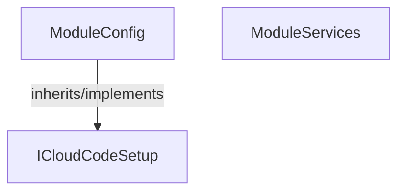

<!-- hash: a51590bfb345f6ade2dab6199633df73 -->
# Initialize Documentation

This document details the purpose and relations of the components in `/Project/Core/Initialize`.

## Component Overview

### `ModuleConfig` (class)
- **Description**: Configures the dependency injection container for cloud code execution.
- **Namespace**: `Global`
- **Inherits/Implements**: `ICloudCodeSetup`
- **Methods**: `Setup`

### `ModuleServices` (class)
- **Description**: Handles statically mapped references to global Unity interfaces.
- **Namespace**: `GameModule.Initialize`

## Dependency & Behavior Schema

[Back to Parent](../CoreRead.md)
