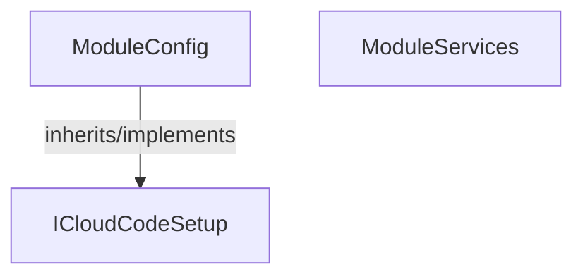

<!-- hash: 622a4f7e08a0844a1b6889462d10afd1 -->
# Initialize Documentation

This document details the purpose and relations of the components in `/Core/Initialize`.

## Component Overview

### `ModuleConfig` (class)
- **Description**: Handles core data and operations for module config within the architecture.
- **Namespace**: `Global`
- **Inherits/Implements**: `ICloudCodeSetup`
- **Methods**: `Setup`

### `ModuleServices` (class)
- **Description**: Handles core data and operations for module services within the architecture.
- **Namespace**: `GameModule.Initialize`

## Dependency & Behavior Schema

[Back to Parent](../CoreRead.md)
