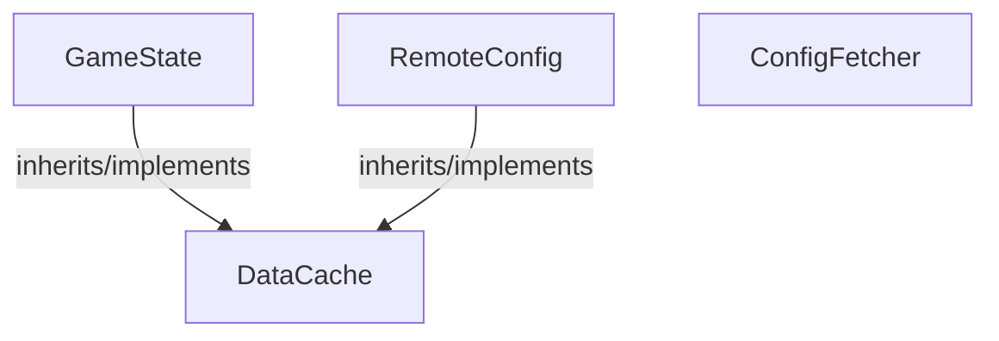

<!-- hash: 308c44f78157085c7c8a5bb33738fdda -->
# ModuleFetchData Documentation

This document details the purpose and relations of the components in `/Core/ModuleFetchData`.

## Sub-Modules

- [Player](Player/PlayerRead.md)

## Component Overview

### `GameState` (class)
- **Description**: Handles core data and operations for game state within the architecture.
- **Namespace**: `GameModule.ModuleFetchData`
- **Inherits/Implements**: `DataCache`
- **Properties**: `Instance`
- **Methods**: `GetDebugKey`

### `RemoteConfig` (class)
- **Description**: Handles core data and operations for remote config within the architecture.
- **Namespace**: `GameModule.ModuleFetchData`
- **Inherits/Implements**: `DataCache`
- **Properties**: `Instance`
- **Methods**: `SaveData`, `DeleteData`, `SaveBatchData`

### `DataCache` (class)
- **Description**: Handles core data and operations for data cache within the architecture.
- **Namespace**: `GameModule.ModuleFetchData`
- **Properties**: `PlayerId`
- **Methods**: `DeleteData`, `SaveBatchData`, `SetPlayerId`, `AddToCache`, `GetDebugKey`, `SaveData`, `InternalSet`

### `ConfigFetcher` (class)
- **Description**: Handles core data and operations for config fetcher within the architecture.
- **Namespace**: `GameModule.ModuleFetchData`
- **Properties**: `Value`, `Configs`, `Type`, `Key`

## Dependency & Behavior Schema

[Back to Parent](../CoreRead.md)
