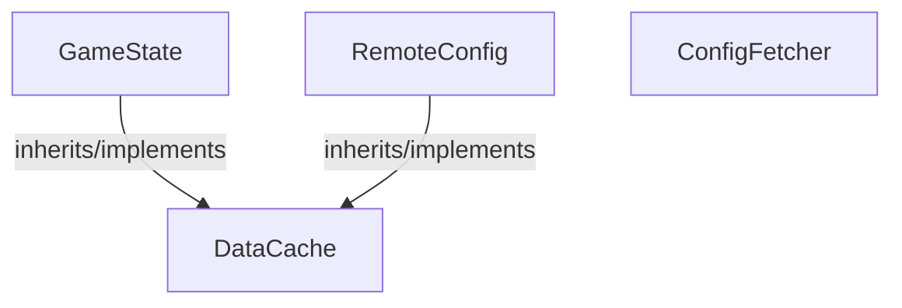

<!-- hash: 9a0ced4ee2329a7b5339e96ba302f286 -->
# ModuleFetchData Documentation

This document details the purpose and relations of the components in `/Project/Core/ModuleFetchData`.

## Sub-Modules

- [Player](Player/PlayerRead.md)

## Component Overview

### `GameState` (class)
- **Description**: Represents server data configurations explicitly.
- **Namespace**: `GameModule.ModuleFetchData`
- **Inherits/Implements**: `DataCache`
- **Properties**: `Instance`
- **Methods**: `GetDebugKey`

### `RemoteConfig` (class)
- **Description**: Connects to Remote Config to fetch server parameters.
- **Namespace**: `GameModule.ModuleFetchData`
- **Inherits/Implements**: `DataCache`
- **Properties**: `Instance`
- **Methods**: `SaveData`, `DeleteData`, `SaveBatchData`

### `DataCache` (class)
- **Description**: Base abstraction for data structures.
- **Namespace**: `GameModule.ModuleFetchData`
- **Properties**: `PlayerId`
- **Methods**: `SetPlayerId`, `GetDebugKey`, `DeleteData`, `InternalSet`, `SaveData`, `AddToCache`, `SaveBatchData`

### `ConfigFetcher` (class)
- **Description**: Handles requests to Unity Remote Config directly fetching game configurations parameters.
- **Namespace**: `GameModule.ModuleFetchData`
- **Properties**: `Value`, `Key`, `Type`, `Configs`

## Dependency & Behavior Schema

[Back to Parent](../CoreRead.md)
