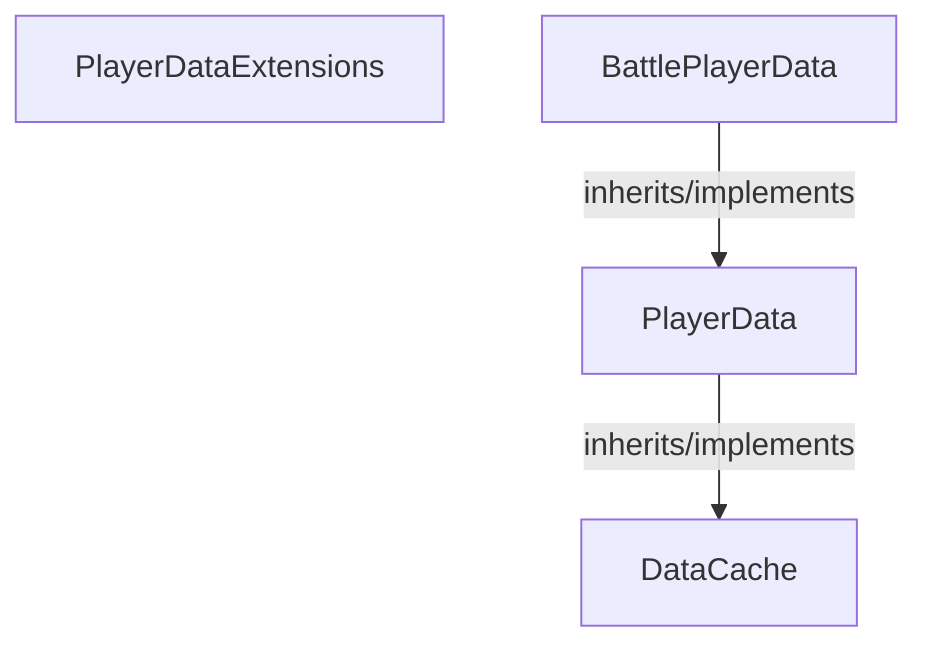

<!-- hash: 00c89de464e66c073864f21a68472d25 -->
# Player Documentation

This document details the purpose and relations of the components in `/Project/Core/ModuleFetchData/Player`.

## Component Overview

### `PlayerDataExtensions` (class)
- **Description**: Utilities logically modifying player data cleanly.
- **Namespace**: `GameModule.ModuleFetchData`
- **Methods**: `AddToCache`

### `PlayerData` (class)
- **Description**: Orchestrates user profile details gracefully.
- **Namespace**: `GameModule.ModuleFetchData`
- **Inherits/Implements**: `DataCache`
- **Methods**: `GetWriteLock`

### `BattlePlayerData` (class)
- **Description**: Subclass handling player fighting states.
- **Namespace**: `GameModule.ModuleFetchData`
- **Inherits/Implements**: `PlayerData`

## Dependency & Behavior Schema

[Back to Parent](../ModuleFetchDataRead.md)
