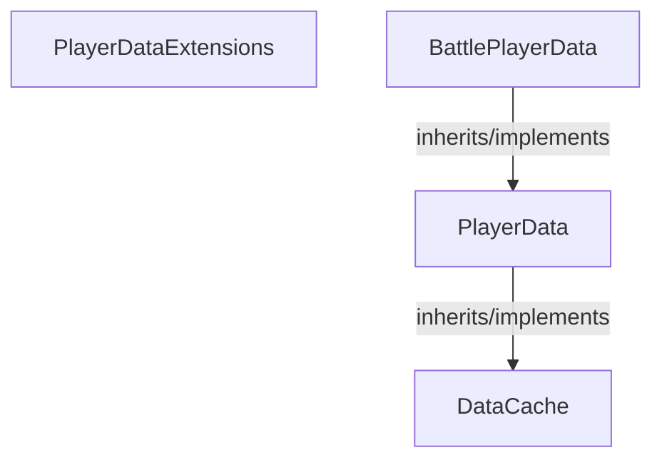

<!-- hash: e4496cb3b242a9144b15a29fc3b750cf -->
# Player Documentation

This document details the purpose and relations of the components in `/Core/ModuleFetchData/Player`.

## Component Overview

### `PlayerDataExtensions` (class)
- **Description**: Provides utility extension methods for player data extensions.
- **Namespace**: `GameModule.ModuleFetchData`
- **Methods**: `AddToCache`

### `PlayerData` (class)
- **Description**: Data container holding state and properties for player data.
- **Namespace**: `GameModule.ModuleFetchData`
- **Inherits/Implements**: `DataCache`
- **Methods**: `GetWriteLock`

### `BattlePlayerData` (class)
- **Description**: Data container holding state and properties for battle player data.
- **Namespace**: `GameModule.ModuleFetchData`
- **Inherits/Implements**: `PlayerData`

## Dependency & Behavior Schema

[Back to Parent](../ModuleFetchDataRead.md)
