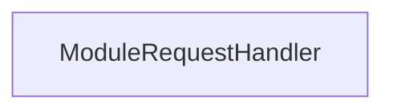

<!-- hash: dd196bbde9b15ade30f2a2ec411208a6 -->
# Response Documentation

This document details the purpose and relations of the components in `/Core/Response`.

## Component Overview

### `ModuleRequestHandler` (class)
- **Description**: Handles core data and operations for module request handler within the architecture.
- **Namespace**: `GameModule.Response`
- **Properties**: `Responses`, `Request`
- **Methods**: `SetCurrentRequest`, `AddResponse`, `NotifyRequestResolve`

## Dependency & Behavior Schema

[Back to Parent](../CoreRead.md)
