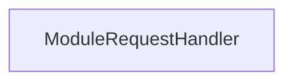

<!-- hash: ccb5ebaddfb5dff5bad436f669744369 -->
# Response Documentation

This document details the purpose and relations of the components in `/Project/Core/Response`.

## Component Overview

### `ModuleRequestHandler` (class)
- **Description**: Processes incoming module queries and formats responses.
- **Namespace**: `GameModule.Response`
- **Properties**: `Request`, `Responses`
- **Methods**: `SetCurrentRequest`, `NotifyRequestResolve`, `AddResponse`

## Dependency & Behavior Schema

[Back to Parent](../CoreRead.md)
