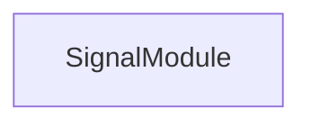

<!-- hash: f099ecf94e63776de029da0e47f3a1fa -->
# Signal Documentation

This document details the purpose and relations of the components in `/Project/Core/Signal`.

## Component Overview

### `SignalModule` (class)
- **Description**: A decoupled event bus system for broadcasting requests.
- **Namespace**: `GameModule.Signal`

## Dependency & Behavior Schema

[Back to Parent](../CoreRead.md)
