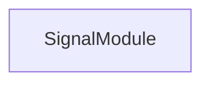

<!-- hash: 395679658b11b06063ed4c3cf3c23c1a -->
# Signal Documentation

This document details the purpose and relations of the components in `/Core/Signal`.

## Component Overview

### `SignalModule` (class)
- **Description**: A core game module responsible for managing signal module logic and state within the game.
- **Namespace**: `GameModule.Signal`

## Dependency & Behavior Schema

[Back to Parent](../CoreRead.md)
