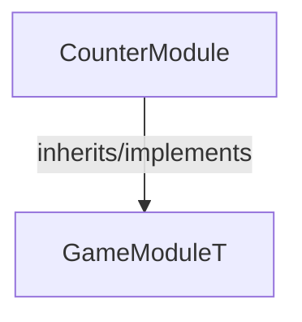

<!-- hash: e03c788e6b1d4e5af5e791291b9f7b9d -->
# CounterModule Documentation

This document details the purpose and relations of the components in `/Project/Sample/CounterModule`.

## Component Overview

### `CounterModule` (class)
- **Description**: Example system demonstrating client increment features.
- **Namespace**: `GameModule.Sample`
- **Inherits/Implements**: `GameModuleT<CounterModuleData>`
- **Properties**: `Client`, `Server`

## Dependency & Behavior Schema

[Back to Parent](../SampleRead.md)
