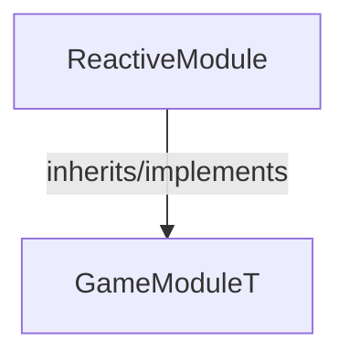

<!-- hash: 511a305d3f5ebf698448216914f751e9 -->
# ReactiveModule Documentation

This document details the purpose and relations of the components in `/Project/Sample/ReactiveModule`.

## Component Overview

### `ReactiveModule` (class)
- **Description**: Example system demonstrating signal subscription capabilities.
- **Namespace**: `GameModule.Sample`
- **Inherits/Implements**: `GameModuleT<ReactiveModuleData>`
- **Properties**: `Client`, `Server`

## Dependency & Behavior Schema

[Back to Parent](../SampleRead.md)
