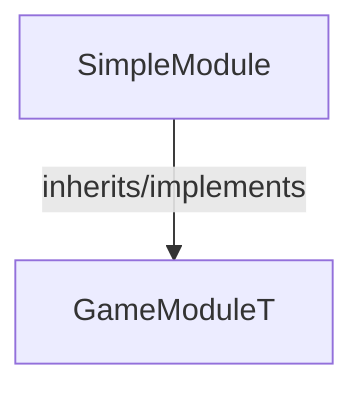

<!-- hash: 7db0fad4558461cad7f1096b65ab998c -->
# SimpleModule Documentation

This document details the purpose and relations of the components in `/Project/Sample/SimpleModule`.

## Component Overview

### `SimpleModule` (class)
- **Description**: Example system showcasing bare minimum implementations.
- **Namespace**: `GameModule.Sample`
- **Inherits/Implements**: `GameModuleT<SimpleModuleData>`
- **Properties**: `Client`, `Server`

## Dependency & Behavior Schema

[Back to Parent](../SampleRead.md)
