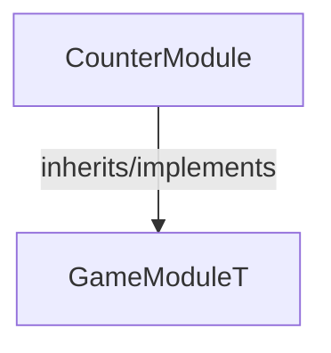

<!-- hash: c441a6d13f30b5774d4c39092107d9e5 -->
# CounterModule Documentation

This document details the purpose and relations of the components in `/Sample/CounterModule`.

## Component Overview

### `CounterModule` (class)
- **Description**: A core game module responsible for managing counter module logic and state within the game.
- **Namespace**: `GameModule.Sample`
- **Inherits/Implements**: `GameModuleT<CounterModuleData>`
- **Properties**: `Client`, `Server`

## Dependency & Behavior Schema

[Back to Parent](../SampleRead.md)
