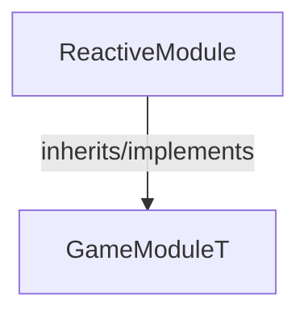

<!-- hash: e9df148b50984baf9c3c13abb6dd66e3 -->
# ReactiveModule Documentation

This document details the purpose and relations of the components in `/Sample/ReactiveModule`.

## Component Overview

### `ReactiveModule` (class)
- **Description**: A core game module responsible for managing reactive module logic and state within the game.
- **Namespace**: `GameModule.Sample`
- **Inherits/Implements**: `GameModuleT<ReactiveModuleData>`
- **Properties**: `Client`, `Server`

## Dependency & Behavior Schema

[Back to Parent](../SampleRead.md)
