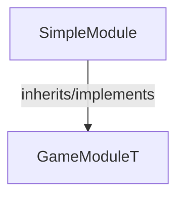

<!-- hash: b5c3650c5b8873c37d6c2b49bc2763a9 -->
# SimpleModule Documentation

This document details the purpose and relations of the components in `/Sample/SimpleModule`.

## Component Overview

### `SimpleModule` (class)
- **Description**: A core game module responsible for managing simple module logic and state within the game.
- **Namespace**: `GameModule.Sample`
- **Inherits/Implements**: `GameModuleT<SimpleModuleData>`
- **Properties**: `Client`, `Server`

## Dependency & Behavior Schema

[Back to Parent](../SampleRead.md)
