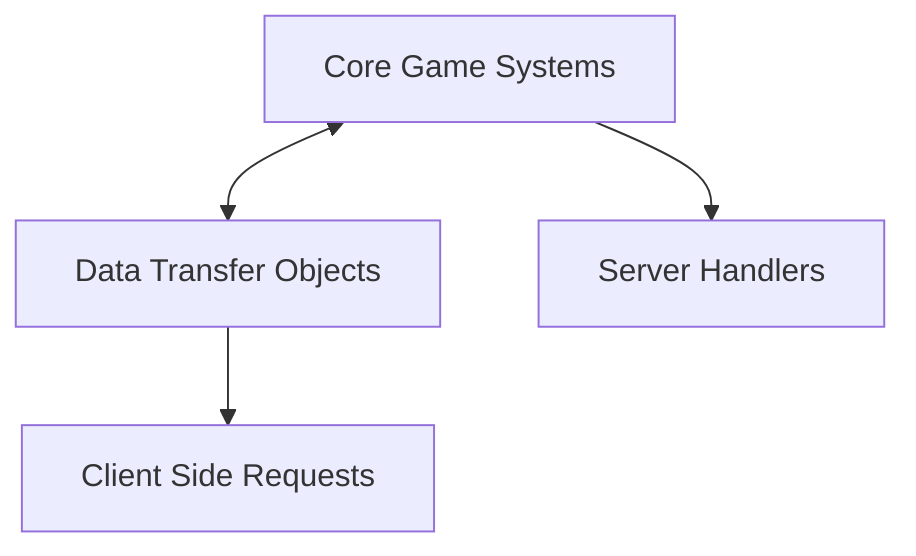

<!-- hash: root -->
# GameModule Root Documentation

## Introduction
This is the main entry point for the GameModule repository. The architecture is split primarily into two domains: **Project** and **GameModuleDTO**.

## Scalability and Architecture
- **GameModuleDTO**: Holds the data transfer objects, keys, requests, and interfaces. It ensures a decoupled standard format that can scale horizontally without affecting logic.
- **Project**: Contains the core logic, implementations of module systems, authentication, state fetchers, and signal management.

## Interactive Systems

## Navigation
- [Project Architecture](Project/ProjectRead.md)
- [GameModuleDTO Overview](GameModuleDTO/GameModuleDTORead.md)
