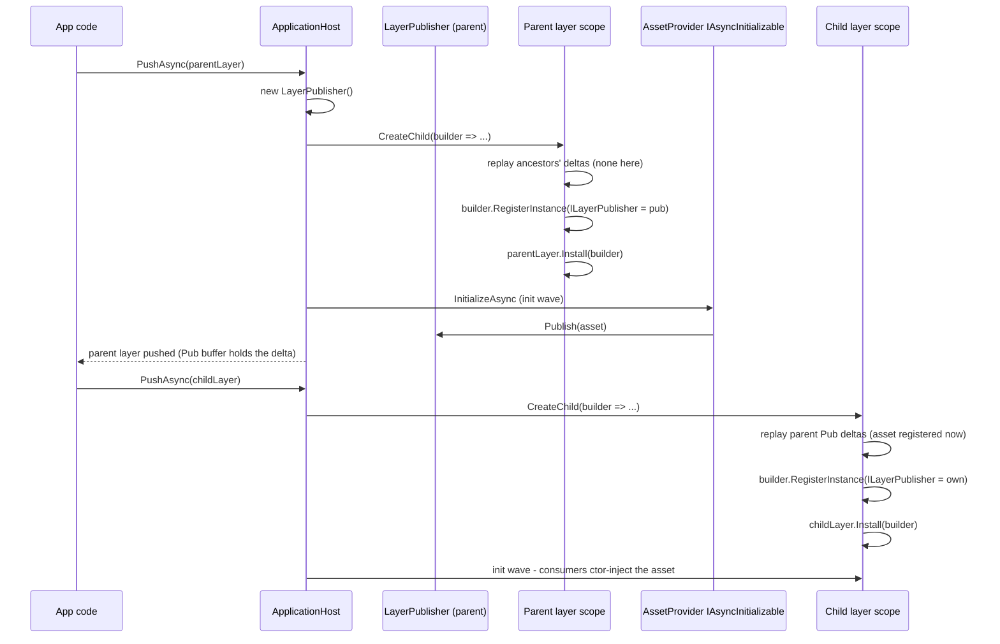

---

name: async-registrar-layer-flow
overview: "Replace the `IAsyncRegistrar`/extended-`PrepareAsync` design with a push-based `ILayerPublisher` flow: each layer gets a per-layer publisher auto-injected by the host, asset providers are normal `IAsyncInitializable` services that ctor-inject the publisher and call `Publish(...)` after loading, and the host replays parent layers' published deltas into every child scope's `IContainerBuilder`. `IAsyncScopeLayer.PrepareAsync` reverts to its original `(parent, ct)` shape and is reserved for parent-resolver introspection that does not register anything. Addressables-specific helpers (`RegisterAddressable<T>`, etc.) are intentionally OUT of `com.scaffold.layeredscope` and ship as extension methods in whatever module owns the loader."
todos:

- id: publisher-contract
content: Add ILayerPublisher contract under Runtime/Contracts.
status: pending
- id: publisher-impl
content: Add internal LayerPublisher implementation under Runtime/Internal.
status: pending
- id: layer-entry-publisher
content: Extend LayerEntry to carry the per-layer publisher (and CreateRoot uses an empty publisher).
status: pending
- id: host-wiring
content: Update ApplicationHost.PushAsync so CreateChild replays every parent layer's published deltas into the child builder, registers the new layer's publisher into the child builder, then runs Install. Store the publisher on the resulting LayerEntry.
status: pending
- id: sample-feature-split
content: Split SampleFeatureLayer into a SampleFeatureAssetsLayer (provider class published via ILayerPublisher) and a SampleFeatureLayer (consumer); update SampleApplicationBootstrap to push both and pop both.
status: pending
- id: tests-update
content: Update ApplicationHostTests - keep ThrowingPrepareLayer (signature unchanged), replace the warmer-based parent/child test with a publisher-based one, add coverage for "asset NOT visible in publishing layer's own scope" and "asset visible in descendant scope after init wave".
status: pending
- id: docs-update
content: Expand Assets/Packages/com.scaffold.layeredscope/README.md with cross-layer registration patterns built around ILayerPublisher as the primary path; keep the warmer + on-demand factory pattern documented as the simpler synchronous alternative; clarify PrepareAsync is now read-only against the parent.
status: pending
- id: validate
content: Run pwsh -NoProfile -File ".agents/scripts/validate-changes.ps1" -SkipTests and fix any analyzer/test failures (per AGENTS.md; -SkipTests applies while automated tests are not maintained).
status: pending
isProject: false

---

## Goal

A descendant layer should be able to constructor-inject an asynchronously-loaded asset published by an ancestor layer with **zero per-asset boilerplate** in the consumer and a **single registration line** in the publisher. Asset providers should look like any other DI service. No `PrepareAsync` plumbing, no `IAsyncRegistrar` parameter, no warmer + factory pair, no per-layer "remember to wire it up". Loader-specific concerns (Addressables, Resources, REST, ...) live entirely outside `com.scaffold.layeredscope` as extension methods.

## Architecture




Key properties:

- **Providers are normal services.** `builder.Register<MyAddressableProvider<T>>(Lifetime.Singleton).As<IAsyncInitializable>()` is the entire registration. They get full ctor injection (e.g. `IAddressableLoader`, configs) from parent scopes via VContainer's normal inheritance.
- **Publish-after-build.** Providers run in the existing init wave AFTER the layer's container is sealed, so the published asset is **not** visible in the publishing layer's own scope. It IS visible to all descendants because the host replays the deltas when their builder is open.
- **Per-layer publisher.** Each layer registers its own `ILayerPublisher` instance into its child scope (shadowing any inherited one), so providers always publish into their own layer's buffer, not an ancestor's.
- **Loader concerns are external.** `com.scaffold.layeredscope` only ships `ILayerPublisher` and the host wiring. `RegisterAddressable<T>(key)`, `AddressableAsset<T>`, `AddressableLabel<T>`, `IAddressableLoader`, etc. are extension methods / classes in the Addressables module (or any other loader module).

## Reverted decisions vs. earlier plan revisions

- `IAsyncScopeLayer.PrepareAsync` keeps its **current** signature `Task PrepareAsync(IObjectResolver parent, CancellationToken ct)`. No `IAsyncRegistrar` parameter is added.
- `IAsyncRegistrar` is dropped from the design entirely.
- `AsyncAssetLayer<T>` convenience base is dropped (already removed in a previous revision).
- `SampleAssetsLayer` is unchanged (warmer + on-demand factory remains the documented synchronous alternative).
- `SampleFeatureLayer` IS rewritten — it's the showcase for the new pattern.

## Files to change

- New: [Assets/Packages/com.scaffold.layeredscope/Runtime/Contracts/ILayerPublisher.cs](../../Assets/Packages/com.scaffold.layeredscope/Runtime/Contracts/ILayerPublisher.cs) (+ `.meta`)
- New: [Assets/Packages/com.scaffold.layeredscope/Runtime/Internal/LayerPublisher.cs](../../Assets/Packages/com.scaffold.layeredscope/Runtime/Internal/LayerPublisher.cs) (+ `.meta`)
- Modify: [Assets/Packages/com.scaffold.layeredscope/Runtime/Internal/LayerEntry.cs](../../Assets/Packages/com.scaffold.layeredscope/Runtime/Internal/LayerEntry.cs) — carry the publisher
- Modify: [Assets/Packages/com.scaffold.layeredscope/Runtime/ApplicationHost.cs](../../Assets/Packages/com.scaffold.layeredscope/Runtime/ApplicationHost.cs) — wire the publisher in `CreateChild` and replay parent stack deltas
- Modify: [Assets/Packages/com.scaffold.layeredscope/Samples/Layers/SampleFeatureLayer.cs](../../Assets/Packages/com.scaffold.layeredscope/Samples/Layers/SampleFeatureLayer.cs) — split into a provider layer + a consumer layer
- Modify: [Assets/Packages/com.scaffold.layeredscope/Samples/SampleApplicationBootstrap.cs](../../Assets/Packages/com.scaffold.layeredscope/Samples/SampleApplicationBootstrap.cs) — push and pop both new layers
- Modify: [Assets/Packages/com.scaffold.layeredscope/Tests/Editor/ApplicationHostTests.cs](../../Assets/Packages/com.scaffold.layeredscope/Tests/Editor/ApplicationHostTests.cs) — replace warmer-based test, add publisher coverage
- Modify: [Assets/Packages/com.scaffold.layeredscope/README.md](../../Assets/Packages/com.scaffold.layeredscope/README.md) — document the new primary pattern (this is the package's authoritative doc per AGENTS.md; no separate `Docs/` page exists today)

## Step 1 — Add `ILayerPublisher` contract

New [Assets/Packages/com.scaffold.layeredscope/Runtime/Contracts/ILayerPublisher.cs](../../Assets/Packages/com.scaffold.layeredscope/Runtime/Contracts/ILayerPublisher.cs):

```csharp
using System.Collections.Generic;

namespace Scaffold.LayeredScope
{
    // Per-layer service auto-registered by ApplicationHost. Asset providers
    // (normal IAsyncInitializable services) ctor-inject this and call
    // Publish/PublishMany after their async load completes. Each call queues
    // a registration delta; when a CHILD layer is later pushed, the host
    // replays every ancestor layer's deltas into the child's IContainerBuilder
    // so descendants can constructor-inject the published assets.
    //
    // Note: published assets are NOT visible in the publishing layer's own
    // scope (the layer's container is sealed before InitializeAsync runs).
    // Loader and consumer must live in different layers. This is by design
    // and matches the layered scoping model.
    public interface ILayerPublisher
    {
        void Publish<T>(T asset) where T : class;
        void Publish<TInterface, TImpl>(TImpl asset) where TImpl : class, TInterface;
        void PublishMany<T>(IReadOnlyList<T> items) where T : class;
    }
}
```

## Step 2 — Add internal `LayerPublisher` implementation

New [Assets/Packages/com.scaffold.layeredscope/Runtime/Internal/LayerPublisher.cs](../../Assets/Packages/com.scaffold.layeredscope/Runtime/Internal/LayerPublisher.cs):

```csharp
using System;
using System.Collections.Generic;
using VContainer;

namespace Scaffold.LayeredScope.Internal
{
    internal sealed class LayerPublisher : ILayerPublisher
    {
        private readonly List<Action<IContainerBuilder>> deltas = new();

        public IReadOnlyList<Action<IContainerBuilder>> Deltas => deltas;

        public void Publish<T>(T asset) where T : class
        {
            if (asset == null) throw new ArgumentNullException(nameof(asset));
            deltas.Add(b => b.RegisterInstance(asset));
        }

        public void Publish<TInterface, TImpl>(TImpl asset) where TImpl : class, TInterface
        {
            if (asset == null) throw new ArgumentNullException(nameof(asset));
            deltas.Add(b => b.RegisterInstance<TInterface, TImpl>(asset));
        }

        public void PublishMany<T>(IReadOnlyList<T> items) where T : class
        {
            if (items == null) throw new ArgumentNullException(nameof(items));
            deltas.Add(b =>
            {
                foreach (var item in items) b.RegisterInstance(item);
                b.RegisterInstance<IReadOnlyList<T>>(items);
            });
        }

        public void Apply(IContainerBuilder builder)
        {
            for (int i = 0; i < deltas.Count; i++) deltas[i](builder);
        }
    }
}
```

## Step 3 — Extend `LayerEntry` with the publisher

Modify [Assets/Packages/com.scaffold.layeredscope/Runtime/Internal/LayerEntry.cs](../../Assets/Packages/com.scaffold.layeredscope/Runtime/Internal/LayerEntry.cs) to carry a `LayerPublisher` and expose it. `CreateRoot` gets an empty publisher (root layer cannot host providers, but a uniform stack walk is simpler than null-checking):

```csharp
public LayerEntry(IScopeLayer layer, LifetimeScope scope,
                  IAsyncInitializable[] inits, IAsyncDisposable[] disposables,
                  LayerPublisher publisher)
{
    Layer = layer;
    Scope = scope;
    OwnedInitializables = inits;
    OwnedDisposables = disposables;
    Publisher = publisher;
}

public LayerPublisher Publisher { get; }

public static LayerEntry CreateRoot(LifetimeScope root)
{
    return new LayerEntry(null, root,
        Array.Empty<IAsyncInitializable>(),
        Array.Empty<IAsyncDisposable>(),
        new LayerPublisher());
}
```

## Step 4 — Wire the publisher through `ApplicationHost.PushAsync`

Modify [Assets/Packages/com.scaffold.layeredscope/Runtime/ApplicationHost.cs](../../Assets/Packages/com.scaffold.layeredscope/Runtime/ApplicationHost.cs):

- `BuildChildScope` becomes the central wiring point. It creates the new layer's `LayerPublisher`, replays every existing stack entry's deltas into the new child builder (root-first), registers the new publisher into the builder so providers in this layer can ctor-inject it, then invokes `layer.Install(builder)`.
- `PushAsync` threads the publisher into `FinishSuccessfulPush` so it can be stored on the new `LayerEntry`.

Sketch of the replacement helpers:

```csharp
public async Task PushAsync(IScopeLayer layer, CancellationToken ct)
{
    if (layer == null) throw new ArgumentNullException(nameof(layer));

    await PrepareLayerAsync(layer, ct); // unchanged - PrepareAsync is read-only against parent
    var publisher = new LayerPublisher();
    LifetimeScope child = BuildChildScope(layer, publisher);
    await AttemptPushAsync(layer, child, publisher, ct);
}

private LifetimeScope BuildChildScope(IScopeLayer layer, LayerPublisher publisher)
{
    return stack.Peek().Scope.CreateChild(builder =>
    {
        // Walk root-first so deeper ancestors override shallower if both publish
        // the same type (last-writer-wins matches VContainer's RegisterInstance).
        foreach (var entry in EnumerateRootFirst())
            entry.Publisher.Apply(builder);

        builder.RegisterInstance<ILayerPublisher>(publisher);
        layer.Install(builder);
    });
}

private IEnumerable<LayerEntry> EnumerateRootFirst()
{
    // Stack<T>.GetEnumerator yields top-first; we want root-first.
    var arr = stack.ToArray();
    for (int i = arr.Length - 1; i >= 0; i--) yield return arr[i];
}
```

`AttemptPushAsync` / `FinishSuccessfulPush` accept the `LayerPublisher` parameter and pass it into the new `LayerEntry(...)` constructor.

`PopAsync` / unwind logic does not change — `LayerPublisher` is plain managed state; it dies with the entry.

## Step 5 — Split `SampleFeatureLayer` into provider + consumer

The current [Assets/Packages/com.scaffold.layeredscope/Samples/Layers/SampleFeatureLayer.cs](../../Assets/Packages/com.scaffold.layeredscope/Samples/Layers/SampleFeatureLayer.cs) loads `SampleAsset` in `PrepareAsync` and registers it via a private field in `Install`. Replace it with two layers in the same file:

```csharp
internal sealed class SampleFeatureAssetProvider : IAsyncInitializable
{
    private readonly ISampleAssetGateway gateway;
    private readonly ILayerPublisher publisher;

    public SampleFeatureAssetProvider(ISampleAssetGateway gateway, ILayerPublisher publisher)
    {
        if (gateway == null) throw new ArgumentNullException(nameof(gateway));
        if (publisher == null) throw new ArgumentNullException(nameof(publisher));
        this.gateway = gateway;
        this.publisher = publisher;
    }

    public async Task InitializeAsync(CancellationToken ct)
    {
        string raw = await gateway.LoadAsync("feature.payload", ct);
        publisher.Publish(new SampleAsset { Payload = raw });
    }
}

internal sealed class SampleFeatureAssetsLayer : IScopeLayer
{
    public string Name => "SampleFeatureAssets";

    public void Install(IContainerBuilder builder)
    {
        // Single-line registration; provider gets full DI, publishes after load.
        builder.Register<SampleFeatureAssetProvider>(Lifetime.Singleton)
            .As<IAsyncInitializable>();
    }
}

internal sealed class SampleFeatureLayer : IScopeLayer
{
    public string Name => "SampleFeature";

    public void Install(IContainerBuilder builder)
    {
        builder.Register<SampleFeatureService>(Lifetime.Singleton)
            .As<IAsyncInitializable>()
            .As<IAsyncDisposable>();
    }
}
```

`SampleFeatureService` is unchanged — it continues to ctor-inject `SampleAsset, SharedSampleAsset, ISampleConfigService, ILayerResolver`. The asset arrives via the parent's published delta instead of an in-layer `RegisterInstance`.

Update [Assets/Packages/com.scaffold.layeredscope/Samples/SampleApplicationBootstrap.cs](../../Assets/Packages/com.scaffold.layeredscope/Samples/SampleApplicationBootstrap.cs):

```csharp
protected override async Task OnReadyAsync(CancellationToken ct)
{
    await Host.PushAsync(new SampleFeatureAssetsLayer(), ct);
    await Host.PushAsync(new SampleFeatureLayer(), ct);
    await Task.Delay(1000, ct);
    await Host.PopAsync(ct); // SampleFeature
    await Host.PopAsync(ct); // SampleFeatureAssets
    Debug.Log("[Sample] feature popped; assets/configs still alive.");
}
```

## Step 6 — Update tests in [Assets/Packages/com.scaffold.layeredscope/Tests/Editor/ApplicationHostTests.cs](../../Assets/Packages/com.scaffold.layeredscope/Tests/Editor/ApplicationHostTests.cs)

- `ThrowingPrepareLayer` is unchanged (`PrepareAsync(parent, ct)` keeps its current signature).
- Replace `ParentLayer_RegistersInstance_InjectableInChildLayer` (and its `SharedAssetWarmer`/`ParentSharedAssetLayer` helpers) with `ParentLayer_PublisherProvider_InjectableInChildLayer`: parent layer registers an `IAsyncInitializable` provider that calls `publisher.Publish(new SharedAsset("from-parent"))`; child layer ctor-injects `SharedAsset` and asserts `Tag == "from-parent"`.
- Add `ProviderPublishedAsset_NotResolvableInPublishingLayer`: after pushing the provider layer, `host.Top.TryResolve<SharedAsset>(out _)` returns false. After pushing a child layer, the same resolve on the child's container returns true. (Locks in the documented limitation.)
- Add `ProviderPublishMany_ExposesIReadOnlyListAndIndividualItems`: publisher with `PublishMany(new[]{ new Item("a"), new Item("b") })`; child resolves `IReadOnlyList<Item>` (count 2) and individual `Item` (last wins).
- Add `ChildLayerPublisher_DoesNotLeakIntoParent`: a child layer's provider publishing does not affect the parent's resolvable types.

## Step 7 — Update [Assets/Packages/com.scaffold.layeredscope/README.md](../../Assets/Packages/com.scaffold.layeredscope/README.md)

> Note: today this README is a ~21-line stub and does **not** yet contain a "Cross-layer registration patterns" section. There is no `Docs/LayeredScope.md` (and no `Docs/Infra/LayeredScope.md`) — the package README is the single authoritative doc per AGENTS.md. Treat the bullets below as **additions** to the README rather than restructuring of an existing section. If you want a `Docs/Infra/LayeredScope.md` pointer file (matching the `Docs/Infra/Scope.md` convention), add it as a thin link to this README in the same change.

- Add a "Cross-layer registration patterns" section organized into three patterns, with the publisher as primary:
  1. **Static parent service, ctor-injected in child** (unchanged).
  2. **Async-loaded asset published by a provider in the parent layer** — NEW primary pattern. Walk through `ILayerPublisher`, the provider class shape, and the loader-above-consumer-below split. Show a one-line `builder.Register<MyProvider>().As<IAsyncInitializable>()` example and stress that loader-specific helpers (`RegisterAddressable<T>`, etc.) are extension methods that live OUTSIDE `com.scaffold.layeredscope`.
  3. **Warmer + on-demand factory** (existing Pattern 2, kept for the synchronous-load case where you don't want to split layers; reference `SampleAssetsLayer`).
- Drop the old Pattern 3 ("per-push asset prepared from parent, instance-registered in own scope") — superseded by the publisher pattern.
- Clarify that `IAsyncScopeLayer.PrepareAsync` is now reserved for **read-only** parent introspection (e.g. deciding which sub-layers to push); it must not be used to register anything in the layer.
- Add a short "Same-layer ctor injection" callout: published assets are visible to descendants only, never to the publishing layer itself. The right architectural response is to put the loader in a parent layer.
- Update "Expected console output (order)" to reflect the split: a new `[SampleFeatureAssetProvider] ...` line replaces the current implicit prepare-time load, and `SampleFeatureAssets` push appears between `SampleConfigs` and `SampleFeature`.
- Add a "Migration" subsection: existing `IAsyncScopeLayer` implementations whose `PrepareAsync` currently registers instances in `Install` via private fields should migrate to a provider-class-in-parent-layer pattern, OR keep using the field+Install pattern (no breaking change to the interface itself).

## Step 8 — Validate

Run the documented milestone quality gate per [AGENTS.md](../../AGENTS.md):

```powershell
pwsh -NoProfile -File ".agents/scripts/validate-changes.ps1" -SkipTests
```

(`-SkipTests` is the current default while EditMode/PlayMode tests are not maintained — drop the flag once they are restored. On Windows PowerShell 5.x, `powershell -NoProfile -ExecutionPolicy Bypass -File ".\.agents\scripts\validate-changes.ps1" -SkipTests` is equivalent. The legacy `.agents/scripts/validate-changes.cmd` wrapper still works and forwards to the same `.ps1`.)

Fix any analyzer/test failures the gate reports.

## Out of scope (deliberately)

- **No Addressables code in `com.scaffold.layeredscope`.** `RegisterAddressable<T>(key)`, `AddressableAsset<T>`, `AddressableLabel<T>`, `IAddressableLoader` and friends are extension methods / classes that live in whatever module owns the Addressables wrapper. The core only ships `ILayerPublisher`. The same `ILayerPublisher` is reused by Resources-, REST-, ScriptableObject-, or any other custom provider — that is the explicit point of keeping it loader-agnostic.
- **No keyed registration** (`PublishKeyed<T>(string key, T)`). Easy to add later as a non-breaking addition.
- **No same-layer asset injection.** Documented limitation. Loader and consumer live in different layers; the architecture pushes you toward the right shape.
- **No removal of `IAsyncScopeLayer.PrepareAsync`.** Kept for read-only parent introspection.
- `**SampleAssetsLayer` and `SharedSampleAssetWarmer` are not touched.** They remain the canonical example of the synchronous warmer + on-demand factory pattern.

