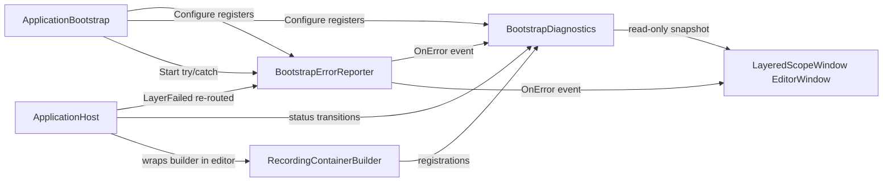

## Goals (sequenced as the user requested)

1. Bootstrap-level error funnel (Milestone 1)
2. Editor inspection window wired to the funnel (Milestone 2)
3. Generic `ApplicationBootstrap` with a drag-drop list of layer assets/behaviours (Milestone 3)

## Current code we are extending

- [Assets/GearEngine/Scripts/Core/LayeredScope/Runtime/ApplicationBootstrap.cs](Assets/GearEngine/Scripts/Core/LayeredScope/Runtime/ApplicationBootstrap.cs) - `Start()` already has try/catch and `OnStartupFailedAsync`. The funnel will plug in here.
- [Assets/GearEngine/Scripts/Core/LayeredScope/Runtime/ApplicationHost.cs](Assets/GearEngine/Scripts/Core/LayeredScope/Runtime/ApplicationHost.cs) - already exposes `event Action<LayerOperation, IScopeLayer, Exception> LayerFailed`. We will re-route it through the funnel and add status callbacks for the inspector.
- [Assets/GearEngine/Scripts/Core/LayeredScope/Runtime/Internal/LayerEntry.cs](Assets/GearEngine/Scripts/Core/LayeredScope/Runtime/Internal/LayerEntry.cs) - extend with status + recorded registrations (editor-only fields gated by `#if UNITY_EDITOR`).
- [Assets/GearEngine/Scripts/Core/LayeredScope/Sample/SampleApplicationBootstrap.cs](Assets/GearEngine/Scripts/Core/LayeredScope/Sample/SampleApplicationBootstrap.cs) - will gain a sibling sample using the generic bootstrap in Milestone 3.

## Architecture overview

---

## Milestone 1 - Bootstrap error funnel

Single registered service that any layer/service can resolve, with multi-subscriber events so the editor window can attach.

New files (Runtime):

- `Runtime/Errors/BootstrapErrorPhase.cs` - enum: `Configure`, `Prepare`, `Install`, `Init`, `Dispose`, `Unwind`, `Startup`, `Manual`.
- `Runtime/Errors/BootstrapErrorInfo.cs` - readonly struct: `Phase`, `LayerName` (nullable), `Source` (free-form string), `Exception`, `TimestampUtc`.
- `Runtime/Errors/IBootstrapErrorReporter.cs` - interface:
  - `void Report(BootstrapErrorInfo info)`
  - `void Report(string source, Exception ex)` (convenience -> `Phase.Manual`)
  - `event Action<BootstrapErrorInfo> OnError`
  - `IReadOnlyList<BootstrapErrorInfo> Recent { get; }` (ring buffer, default 64)
- `Runtime/Errors/BootstrapErrorReporter.cs` - default implementation. Always logs via `Debug.LogError` (matching `AGENTS.md` rules) before raising `OnError`. Wraps subscriber exceptions in try/catch (mirrors the pattern in `RaiseLayerFailed`).

Wire-up changes:

- `ApplicationBootstrap.Configure`: register `BootstrapErrorReporter` as `IBootstrapErrorReporter` singleton next to `LayerResolverProxy`.
- `ApplicationBootstrap.Start`: replace inline `Debug.LogError` with `reporter.Report(new BootstrapErrorInfo(Phase.Startup, ...))` before `SafeOnStartupFailedAsync`. `OnStartupFailedAsync` stays as a user-overridable hook, but is no longer the only entry point.
- `ApplicationHost`: take an `IBootstrapErrorReporter` (resolved from root) in the constructor. Replace direct `Debug.LogError` + `RaiseLayerFailed` with reporter calls keyed by `LayerOperation -> BootstrapErrorPhase`. Keep the legacy `LayerFailed` event for back-compat but have it raised from the reporter callback.

Tests (`Tests/Editor`):

- `BootstrapErrorReporter_RaisesOnError_WhenLayerInstallThrows`
- `BootstrapErrorReporter_RaisesOnError_WhenPrepareAsyncThrows`
- `BootstrapErrorReporter_RaisesOnError_WhenInitializableThrows`
- `BootstrapErrorReporter_Manual_Report_IsRecordedAndRaised`
- `Reporter_SubscriberException_DoesNotBreakHost` (regression for handler-throws path)

## Milestone 2 - Editor inspection window

Live view of the scope stack with per-layer status, init/dispose counts, registered types, and last error. Subscribes to the funnel from M1.

New runtime pieces (still in `Core.LayeredScope`, editor data gated by `#if UNITY_EDITOR` to keep build clean):

- `Runtime/Diagnostics/LayerStatus.cs` - enum: `Pending`, `Preparing`, `Installing`, `Initializing`, `Ready`, `Failed`, `Disposing`, `Disposed`.
- `Runtime/Diagnostics/LayerRegistrationInfo.cs` - `Type[] ServiceTypes`, `Type ImplementationType`, `Lifetime Lifetime`.
- `Runtime/Diagnostics/LayerSnapshot.cs` - `LayerName`, `Status`, `InitCount`, `DisposeCount`, `LastError` (`BootstrapErrorInfo?`), `IReadOnlyList<LayerRegistrationInfo> Registrations`.
- `Runtime/Diagnostics/IBootstrapDiagnostics.cs` - readonly snapshot API:
  - `IReadOnlyList<LayerSnapshot> Stack { get; }` (root-first)
  - `event Action OnChanged`
- `Runtime/Diagnostics/BootstrapDiagnostics.cs` - default implementation, registered alongside the reporter in `ApplicationBootstrap.Configure`. Raises `OnChanged` after every status transition. Also subscribes to the reporter to attach `LastError` to the matching layer.
- `Runtime/Internal/RecordingContainerBuilder.cs` (#if UNITY_EDITOR) - decorator over `IContainerBuilder` that captures every `Register*` call into a `List<LayerRegistrationInfo>`. Used in `ApplicationHost.BuildChildScope` only when diagnostics is enabled, so production builds pay nothing.

`ApplicationHost` updates:

- New ctor argument `BootstrapDiagnostics diagnostics` (resolved from root).
- Push diagnostics events at every state change: `Preparing` before `PrepareAsync`, `Installing` before `BuildChildScope`, `Initializing` before `RunInitWaveAsync`, `Ready` after success, `Failed` on exceptions, `Disposing`/`Disposed` around `RunDisposeWaveAsync`.
- When recording, swap `stack.Peek().Scope.CreateChild(layer.Install)` for a wrapped builder that hands the captured registrations to the new `LayerEntry` field.

New asmdef `Editor/Core.LayeredScope.Editor.asmdef` (Editor-only, references `Core.LayeredScope`, `VContainer`):

- `Editor/Inspector/LayeredScopeWindow.cs` - `EditorWindow` opened via `Window > LayeredScope > Inspector`. Two-pane UI Toolkit window:
  - Left: tree of active scope stack (one entry per layer, root at top), color-coded by `LayerStatus`, with init/dispose counts.
  - Right: details for the selected layer - status timeline, last error (clickable stack trace), and a foldout listing registered services (`Lifetime  ServiceTypes  ->  ImplementationType`).
  - Refreshes on `OnChanged` plus an `EditorApplication.update` poll for safety. Discovers the active bootstrap via `Object.FindObjectOfType<ApplicationBootstrap>()`.
- `Editor/Inspector/LayerStatusStyles.cs` - small helper for status colors/labels.

Tests:

- `BootstrapDiagnostics_StatusTransitions_AreCapturedInOrder`
- `BootstrapDiagnostics_RecordsRegistrationsPerLayer` (uses the recording builder; verifies a known type is listed only in its owning layer)
- `BootstrapDiagnostics_AttachesErrorToFailingLayer`

Docs: append an "Editor inspector" section to [Docs/LayeredScope.md](Docs/LayeredScope.md).

## Milestone 3 - Generic drag-drop ApplicationBootstrap

Layer authors can ship layers as either ScriptableObjects or MonoBehaviours and drop them into a single list on a generic bootstrap.

New runtime pieces:

- `Runtime/Authoring/ScopeLayerAsset.cs` - abstract `ScriptableObject` with `public abstract IScopeLayer Create();`.
- `Runtime/Authoring/ScopeLayerBehaviour.cs` - abstract `MonoBehaviour` with `public abstract IScopeLayer Create();`.
- `Runtime/Authoring/ScopeLayerReference.cs` - `[Serializable]` struct holding a single `UnityEngine.Object` field. `TryCreate(out IScopeLayer layer, out string error)` validates and dispatches to whichever interface is implemented.
- `Runtime/GenericApplicationBootstrap.cs` - concrete `ApplicationBootstrap` with `[SerializeField] List<ScopeLayerReference> layers;`. `GetInitialLayers()` yields each `Create()` and reports invalid entries through `IBootstrapErrorReporter` (Phase = `Configure`).

Editor pieces (in the same `Core.LayeredScope.Editor` asmdef):

- `Editor/Authoring/ScopeLayerReferencePropertyDrawer.cs` - object-field drawer that filters to `ScopeLayerAsset` or `ScopeLayerBehaviour` and shows a red badge if the assigned object is neither.
- `Editor/Authoring/GenericApplicationBootstrapEditor.cs` - custom inspector with a reorderable list of `ScopeLayerReference`, per-row status badge (when in Play, mirrors `LayerStatus`), and a "Open LayeredScope Window" button.

Sample:

- Add `Sample/Layers/SampleAssetsLayerAsset.cs` (ScriptableObject) and a small ScopeLayerBehaviour example to demonstrate both code paths. Keep the existing `SampleApplicationBootstrap` for the code-driven example; add a second scene `Sample/Scenes/LayeredScopeGenericSample.unity` driven by `GenericApplicationBootstrap`.

Tests:

- `ScopeLayerReference_TryCreate_RejectsUnassignedAndWrongType`
- `GenericApplicationBootstrap_BuildsInListOrder`
- `GenericApplicationBootstrap_InvalidLayer_ReportedThroughReporter`

Docs: extend [Docs/LayeredScope.md](Docs/LayeredScope.md) with an "Authoring layers as assets" section.

## Validation per milestone

For each milestone follow the standard quality loop in `AGENTS.md`:

1. Implement the milestone scope.
2. Add/extend tests (failing first when fixing a bug, otherwise green-field tests).
3. Run `.agents/scripts/validate-changes.cmd` and resolve any analyzer or test failures.
4. Commit per milestone.

## Out of scope

- No changes to `IInLayerScheduler` / `ParallelScheduler`.
- No serialization of runtime diagnostics to disk.
- No production-build inspector UI (window is `UNITY_EDITOR` only).

