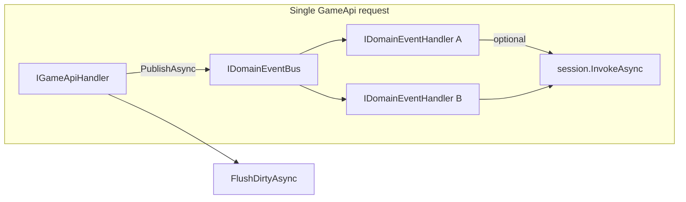

# Server domain events + DTO storage keys

## Context (current state)

- `[GameApiDispatcher](LiveOps/Project/Core/GameApi/GameApiDispatcher.cs)` already calls `[SignalModule.Push(requestObj)](LiveOps/Project/Core/Signal/SignalModule.cs)` after a successful handler; nothing in the repo registers `Subscribe`, so this is effectively unused for features today.
- Cross-handler orchestration for **client-visible** side effects remains `[GameApiSession.InvokeAsync](LiveOps/Project/Core/GameApi/GameApiSession.cs)` + nested `[ModuleResponse](LiveOps/LiveOps.DTO/Core/ModuleRequest/Abstraction/ModuleResponse.cs)` (unchanged).
- Persistence / RC keys are duplicated as `public const` on each `[*Module](LiveOps/Project/Modules/Cards/CardsModule.cs)` (and private consts in `[CurrencyModule](LiveOps/Project/Modules/Currency/CurrencyModule.cs)`)), while the actual serialized types live in `[LiveOps.DTO](LiveOps/LiveOps.DTO/Modules/Cards/CardPersistence.cs)`.




## Part A — Server domain event bus

**Goal:** Allow multiple server components to react to a **domain fact** (e.g. `QuestCompleted`, `InventoryChanged`) in the same Cloud Code invocation without the publisher importing every consumer. This complements, not replaces, `InvokeAsync` for typed nested responses.

**Design (minimal, DI-friendly, net6-compatible):**

1. **New folder** under `[LiveOps/Project/Core/](LiveOps/Project/Core/)` (e.g. `DomainEvents/`).
2. **Core types**
  - `IDomainEvent` — marker interface (optional base with metadata later: correlation id, timestamp).
  - `IDomainEventHandler<in TEvent>` — `Task HandleAsync(GameApiSession session, TEvent evt, CancellationToken cancellationToken = default)` so handlers can call `session.InvokeAsync`, read `session.Player`, etc.
  - `IDomainEventBus` — `Task PublishAsync<TEvent>(GameApiSession session, TEvent evt, CancellationToken cancellationToken = default) where TEvent : IDomainEvent`.
3. `**DomainEventBus` implementation**
  - Resolve `IEnumerable<IDomainEventHandler<TEvent>>` from the scoped `IServiceProvider` (same pattern as multiple `IValidator<T>` registrations in MS.DI).
  - **Dispatch order:** sequential `await` over handlers (deterministic; document in XML).
  - **Error policy (default):** on handler exception, log with `ILogger`, continue remaining handlers, then rethrow **or** swallow based on a single enum/flag on the bus — pick one default and document it (recommend: **log + continue** for analytics-style listeners, **fail-fast** optional for future `PublishOptions`).

**Snippets — contracts and bus (illustrative, adjust namespaces to `GameModule.DomainEvents` or similar):**

```csharp
// IDomainEvent.cs
namespace GameModule.DomainEvents;

public interface IDomainEvent { }
```

```csharp
// IDomainEventHandler.cs
using System.Threading;
using System.Threading.Tasks;
using GameModule.GameApi;

namespace GameModule.DomainEvents;

public interface IDomainEventHandler<in TEvent> where TEvent : IDomainEvent
{
    Task HandleAsync(GameApiSession session, TEvent evt, CancellationToken cancellationToken = default);
}
```

```csharp
// IDomainEventBus.cs
using System.Threading;
using System.Threading.Tasks;
using GameModule.GameApi;

namespace GameModule.DomainEvents;

public interface IDomainEventBus
{
    Task PublishAsync<TEvent>(GameApiSession session, TEvent evt, CancellationToken cancellationToken = default)
        where TEvent : IDomainEvent;
}
```

```csharp
// DomainEventBus.cs — default: log + continue; optional fail-fast via ctor flag / options type
using System;
using System.Collections.Generic;
using System.Threading;
using System.Threading.Tasks;
using GameModule.GameApi;
using Microsoft.Extensions.DependencyInjection;
using Microsoft.Extensions.Logging;

namespace GameModule.DomainEvents;

public sealed class DomainEventBus : IDomainEventBus
{
    private readonly IServiceProvider _services;
    private readonly ILogger<DomainEventBus> _logger;
    private readonly bool _continueOnHandlerError;

    public DomainEventBus(IServiceProvider services, ILogger<DomainEventBus> logger, bool continueOnHandlerError = true)
    {
        _services = services ?? throw new ArgumentNullException(nameof(services));
        _logger = logger ?? throw new ArgumentNullException(nameof(logger));
        _continueOnHandlerError = continueOnHandlerError;
    }

    public async Task PublishAsync<TEvent>(GameApiSession session, TEvent evt, CancellationToken cancellationToken = default)
        where TEvent : IDomainEvent
    {
        IEnumerable<IDomainEventHandler<TEvent>> handlers = _services.GetServices<IDomainEventHandler<TEvent>>();
        foreach (IDomainEventHandler<TEvent> handler in handlers)
        {
            if (handler == null) continue;
            try
            {
                await handler.HandleAsync(session, evt, cancellationToken).ConfigureAwait(false);
            }
            catch (Exception ex)
            {
                _logger.LogError(ex, "[DomainEventBus] Handler {Handler} failed for {Event}", handler.GetType().Name, typeof(TEvent).Name);
                if (!_continueOnHandlerError) throw;
            }
        }
    }
}
```

```csharp
// Example event + two handlers (live feature code lives under LiveOps/Project/Modules/...)
using GameModule.DomainEvents;
using GameModule.GameApi;
using GameModuleDTO.ModuleRequests;
using Microsoft.Extensions.Logging;

namespace GameModule.Modules.Quests;

public sealed record QuestCompletedEvent(string QuestId, string PlayerId) : IDomainEvent;

public sealed class GrantQuestCurrencyOnCompleteHandler : IDomainEventHandler<QuestCompletedEvent>
{
    public async Task HandleAsync(GameApiSession session, QuestCompletedEvent evt, CancellationToken cancellationToken = default)
    {
        _ = await session.InvokeAsync(new AddCurrencyRequest("gold", 100)).ConfigureAwait(false);
    }
}

public sealed class LogQuestCompletionHandler : IDomainEventHandler<QuestCompletedEvent>
{
    private readonly ILogger<LogQuestCompletionHandler> _logger;

    public LogQuestCompletionHandler(ILogger<LogQuestCompletionHandler> logger) => _logger = logger;

    public Task HandleAsync(GameApiSession session, QuestCompletedEvent evt, CancellationToken cancellationToken = default)
    {
        _logger.LogInformation("Quest {QuestId} completed", evt.QuestId);
        return Task.CompletedTask;
    }
}
```

```csharp
// Publisher inside an IGameApiHandler — inject IDomainEventBus in ctor
public sealed class CompleteQuestHandler : IGameApiHandler<CompleteQuestRequest, CompleteQuestResponse>
{
    private readonly IDomainEventBus _domainEvents;

    public CompleteQuestHandler(IDomainEventBus domainEvents) => _domainEvents = domainEvents;

    public async Task<CompleteQuestResponse> HandleAsync(GameApiSession session, CompleteQuestRequest request)
    {
        // ... mutate quest persistence ...
        await _domainEvents.PublishAsync(session, new QuestCompletedEvent(request.QuestId, session.Context.PlayerId), default)
            .ConfigureAwait(false);
        return new CompleteQuestResponse(/* ... */);
    }
}
```

```csharp
// ModuleConfig.Setup — register bus; resolve IEnumerable<IDomainEventHandler<T>> via GetServices
// using Microsoft.Extensions.DependencyInjection.Extensions;

RegisterScoped<IDomainEventBus, DomainEventBus>(config);

// After existing GameApi handler scan: register each concrete handler as its closed IDomainEventHandler<TEvent>
foreach (Type impl in gameApiAssembly.GetTypes())
{
    if (impl.IsAbstract || impl.IsInterface) continue;
    foreach (Type iface in impl.GetInterfaces())
    {
        if (!iface.IsGenericType) continue;
        if (iface.GetGenericTypeDefinition() != typeof(IDomainEventHandler<>)) continue;
        config.Dependencies.AddScoped(iface, impl); // e.g. IDomainEventHandler<QuestCompletedEvent> -> LogQuestCompletionHandler
        break;
    }
}
```

**Note:** `IServiceProvider.GetServices<T>()` lives in `Microsoft.Extensions.DependencyInjection` — add a `PackageReference` if `[LiveOps.csproj](LiveOps/Project/LiveOps.csproj)` does not already pull it in transitively (Abstractions alone is not enough for the extension method).

1. **Registration in `[ModuleConfig.Setup](LiveOps/Project/Core/Initialize/ModuleConfig.cs)`**
  - `RegisterScoped<IDomainEventBus, DomainEventBus>(config)`.
  - Register each concrete `IDomainEventHandler<T>` as scoped (mirror the existing handler scan loop over `[GameApiDispatcher](LiveOps/Project/Core/GameApi/GameApiDispatcher.cs)`.Assembly, filtering assignable to `IDomainEventHandler<>` with `GetInterfaces()` — see snippet above; refine if Cloud Code DI does not support open-generic service registration the same way as stock MS.DI).
2. **Integration points**
  - Inject `IDomainEventBus` into handlers/modules that need to publish.
  - **Optional:** add `GameApiSession.PublishAsync<T>(T evt)` as a thin forwarder to the bus (requires session to hold a bus reference — only worth it if you want discoverability; otherwise keep bus explicit in ctor).
3. `**SignalModule` decision (document in plan execution)**
  - Either leave as-is for rare “request completed” hooks, or add a **single** optional bridge: after successful `HandleAsync`, `PublishAsync(session, new GameApiRequestHandled(requestObj))` if you introduce that event type — avoids two unrelated buses long-term. Not required for MVP.

**Tests** (`[LiveOps.Tests](LiveOps/Tests/LiveOps.Tests.csproj)`):

- Unit test `DomainEventBus`: two handlers for same event both run; first throws → second still runs (if “continue” policy) or request fails (if “fail-fast”).
- Optional integration-style test with a tiny `TestDomainEvent` + handlers registered in `ServiceCollection` like `[GameApiDispatcherTests](LiveOps/Tests/GameApiDispatcherTests.cs)`.

**Snippet — bus unit test (xUnit + Microsoft.Extensions.DependencyInjection):**

```csharp
// Arrange: TestDomainEvent + two handlers; ServiceCollection registers both as IDomainEventHandler<TestDomainEvent>
await using ServiceProvider sp = services.BuildServiceProvider();
var bus = sp.GetRequiredService<IDomainEventBus>();
var session = /* mock or minimal GameApiSession */;

await bus.PublishAsync(session, new TestDomainEvent(1));

// Assert: both handlers ran; if testing continue-on-error, assert second handler ran after first throws
```

**Docs:** Short section in `[Docs/LiveOps/NewApiAndServices.md](Docs/LiveOps/NewApiAndServices.md)` or `[Docs/LiveOps/GameApi.md](Docs/LiveOps/GameApi.md)` — when to use `InvokeAsync` (client-visible nested response) vs domain events (server-internal fan-out), and reminder that **client** reactions still flow through nested `ModuleResponse` + `IResponseHandler`.

---

## Part B — Storage / config keys on DTOs

**Goal:** Single source of truth for Cloud Save and Remote Config key strings, colocated with the serialized DTO so `[*Module](LiveOps/Project/Modules/Tracks/TracksModule.cs)` and handlers stop duplicating `PersistenceKey` / `ConfigKey`.

**Approach (no unsealing required):**

1. On each persistence type in `[LiveOps.DTO](LiveOps/LiveOps.DTO/)` (e.g. `[CardPersistence](LiveOps/LiveOps.DTO/Modules/Cards/CardPersistence.cs)`, `TrackPersistence`, `LoadoutPersistence`, `InventoryPersistence`, `CurrencyPersistence`), add:
  - `public const string StorageKey = nameof(CardPersistence);` (name chosen to avoid clashing with JSON `Key` semantics and `IGameModuleData.Key`).
2. On each remote config DTO (`*Config` classes), add:
  - `public const string RemoteConfigKey = nameof(CardConfig);` (or `ConfigKey` if you prefer consistency with existing naming — pick one name repo-wide).

**Snippets — DTO keys and call sites:**

```csharp
// LiveOps.DTO — CardPersistence.cs (add next to class declaration; string value matches existing Cloud Save key)
using Newtonsoft.Json;

public sealed class CardPersistence
{
    public const string StorageKey = nameof(CardPersistence);

    [JsonProperty("unlocked")]
    public List<string> Unlocked { get; set; } = new List<string>();
}
```

```csharp
// LiveOps.DTO — CardConfig.cs
public sealed class CardConfig
{
    public const string RemoteConfigKey = nameof(CardConfig);

    [JsonProperty("catalog")]
    public List<string> Catalog { get; set; } = new List<string>();
    // ...
}
```

```csharp
// LiveOps/Project — CardsModule.Initialize (before/after pattern)
CardConfig config = await remoteConfig.Get(context, CardConfig.RemoteConfigKey, new CardConfig()).ConfigureAwait(false);
CardPersistence persistence = await player.Get(context, CardPersistence.StorageKey, new CardPersistence()).ConfigureAwait(false);
```

```csharp
// LiveOps/Project — handler using session.Player / session.RemoteConfig
CardConfig config = await session.RemoteConfig.Get(session.Context, CardConfig.RemoteConfigKey, new CardConfig()).ConfigureAwait(false);
CardPersistence persistence = await session.Player.Get(session.Context, CardPersistence.StorageKey, new CardPersistence()).ConfigureAwait(false);
// ...
await session.Player.Set(session.Context, CardPersistence.StorageKey, persistence).ConfigureAwait(false);
```

1. **Migrate call sites** in `LiveOps/Project` modules and handlers (grep for `PersistenceKey`, `ConfigKey`, and `CurrencyModule` private const usage) to reference `CardPersistence.StorageKey`, `CardConfig.RemoteConfigKey`, etc.
2. **Remove** redundant `public const` / `private const` key definitions from `*Module` classes once nothing references them.
3. **Naming / migration note** in docs: keys remain **string-identical** to today’s `nameof(Type)` values so existing Cloud Save / RC entries are unaffected.

**Tests:** Existing GameApi / module tests should continue to pass; update any mocks that assert specific key strings if they exist.

---

## Suggested implementation order

1. DTO key constants + migrate modules/handlers (low risk, improves ergonomics immediately).
2. Domain event abstractions + bus + DI registration + unit tests.
3. One **reference** usage (e.g. publish a `GameApiRequestHandled` or a placeholder `ExampleDomainEvent` from a test-only handler) — **or** skip until a real feature (quests) lands, but having one production publish site prevents dead code.

## Out of scope (explicit)

- Changing `IGameModuleData` / `FlushDirtyAsync` behavior.
- Client-side event bus (Unity) — still `[IResponseHandler](Assets/Packages/com.scaffold.liveops/Runtime/IResponseHandler.cs)` for nested responses.
- New NuGet packages (e.g. MediatR) — keep in-process bus minimal.

