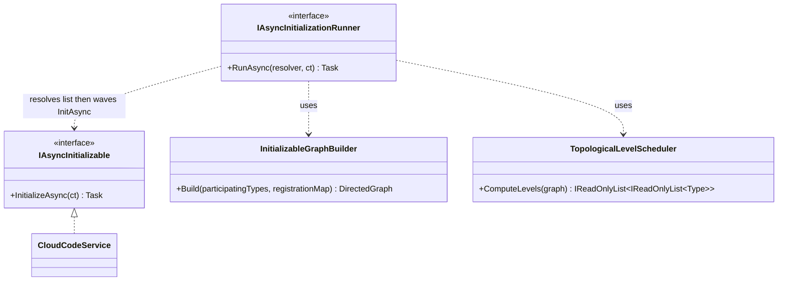
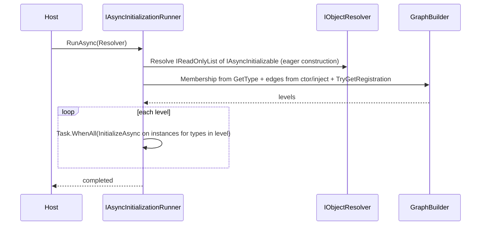
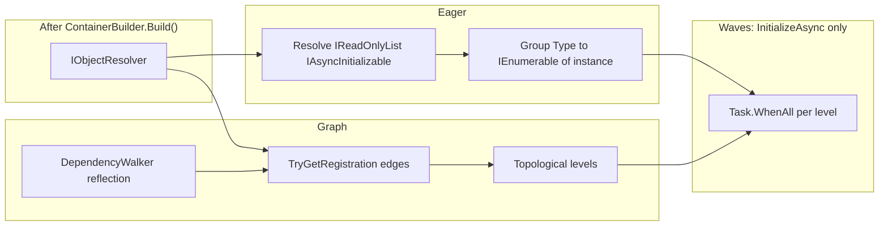

# Startup: initialization ordering (implementation outline)

**Runtime note:** Application startup and per-layer async init are implemented in **`Scaffold.LayeredScope`** (`ApplicationBootstrap`, `ApplicationHost`, `IAsyncInitializable`). This document remains an optional design outline for dependency-graph–ordered init waves.

This document is an **implementation outline** only—no code in the repo is required to match it until an ExecPlan adopts it.

**Related:** [Startup: two-scope preload](Startup-Two-Scope-Preload.md) — base scope, preload, main scope, and how init ordering runs per scope.

## Goal

After `Build()`, run async initialization in **dependency-derived** waves (parallel within a wave). No manual order, no numeric indexes. Attributes allowed only as **markers** (no order values).

## Problem

After the container is built, every participant that needs ordered async startup should run `InitializeAsync` such that **if type A’s constructor (or VContainer inject sites) depends on type B, then B’s initialization completes before A’s** (when both participate in startup). **No handwritten sequence.**

## Core idea

- Define a single contract, e.g. `IAsyncInitializable` (name TBD), with `Task InitializeAsync(CancellationToken cancellationToken)`.
- **Membership**: Prefer **all types registered as `IAsyncInitializable`** via **collection resolve** + concrete `GetType()` (see “Discovery”); optional explicit list (`IInitializableTypeSource`).
- **Edges**: For each participating concrete type `T`, inspect **constructor parameters** and **inject fields/properties** (same rules VContainer uses). For each parameter type `D`:
  - Resolve `D` to a **concrete** registered implementation type (see “Interface mapping”).
  - If that concrete type also participates in `IAsyncInitializable`, add a directed edge **`DConcrete → T`** (“initialize `DConcrete` before `T`”).
- **Sort**: Compute **topological levels** (Kahn / level-by-level). **Cycle** ⇒ fail fast with diagnostic. A dependency that is **not** in the `IAsyncInitializable` membership set is **not** part of init ordering (no edge); DI is unchanged—it is still injected and constructed normally.
- **Execution**: Participants are **already constructed** (eager). For level `0..L`, `await Task.WhenAll` for **`InitializeAsync` on every instance** for types at that level (group by concrete type when multiple registrations share a type).

Constructor/inject reflection **reuses the same dependency shape as DI**, so you do not maintain a parallel “init order” list.

## Discovery (membership set)

The graph needs the **set of concrete types** that participate in startup.

**Canonical approach (this plan):** Register every participant with `.As<IAsyncInitializable>()`, then after `Build()` resolve **`IReadOnlyList<IAsyncInitializable>`** (or `IEnumerable<IAsyncInitializable>`—confirm collection registration for your VContainer version). That **constructs all participants at once**. Group by concrete type: **`Dictionary<Type, IReadOnlyList<IAsyncInitializable>>`** or equivalent (e.g. `ILookup<Type, IAsyncInitializable>`) so **multiple registrations of the same concrete type** are all invoked in the same waves. **Waves only order `InitializeAsync`**, not construction.

**Ordering scope:** **Per container** — one runner pass per built `IObjectResolver`; no cross-container ordering in this plan.

| Approach | Pros | Cons |
|----------|------|------|
| **Collection resolve (canonical)** | Membership matches registrations; no parallel `Add<T>()` list. | Eager construction of every participant when the collection is resolved. |
| **A. Explicit type list (`IInitializableTypeSource`)** | Opt-in list without touching instances; useful if you later need lazy construction. | Extra type and installer wiring. |
| **B. Container introspection** | No per-type calls if the container exposes a full registration catalog. | VContainer does not expose a full public catalog; usually unnecessary if **collection resolve** works. |
| **C. Assembly scan** | Zero installer lines. | Heuristic; may pick types you did not register; needs filters. |

**Recommendation:** Use **collection resolve** + **dictionary by concrete type** for the runner. Keep **explicit `IInitializableTypeSource`** as an optional alternative.

## Interface mapping

When the ctor takes `ICloudCodeService`, the edge uses the **implementation** type returned by **`IObjectResolver.TryGetRegistration`** for that inject site (same keys as VContainer). That matches **exactly what VContainer does** for resolution and circular-dependency analysis—no separate ambiguity rules in Scaffold.

**Multiple registrations of the same service type:** Follow VContainer’s registration lookup; the edge uses the **`Registration.ImplementationType`** from `TryGetRegistration` for that parameter type and key.

## Optional attributes (markers only)

- **`[InitEdgeIgnored]`** on a parameter: do not add an edge from that dependency (rare escape hatch).
- **`[InitRequires<T>]`** on the type: only if reflection cannot see a dependency (legacy code). **No integers.**

Avoid attributes unless a specific registration is invisible to reflection.

## Public API (sketch)

```text
IAsyncInitializable
  + InitializeAsync(CancellationToken) : Task

IAsyncInitializationRunner      // lives in Scope package
  + RunAsync(IObjectResolver, CancellationToken) : Task

IInitializableTypeSource         // optional; only if not using collection resolve for membership
  + ParticipatingImplementationTypes : IReadOnlyCollection<Type>
```

- **`IAsyncInitializationRunner`**: resolves **`IReadOnlyList<IAsyncInitializable>`** (eager construction), builds membership + edges + levels from **`IObjectResolver.TryGetRegistration`** + dependency reflection, then runs **`InitializeAsync` in waves** (parallel within a wave). Does **not** need a separate membership registry when using collection resolve.

**Note:** This outline assumes **eager construction** of all `IAsyncInitializable` registrations, then **wave-ordered `InitializeAsync` only**. Match VContainer lifetimes (typically singletons) when resolving the collection. **`IAsyncInitializable` does not take `IObjectResolver`** — only `CancellationToken` (runner has the resolver; participants do not).

## UML-style diagram (Mermaid)



## Sequence (single container, after `Build()`)



## Failure modes

- **Cycle** in init-only subgraph → throw with type cycle path.
- **Constructor parameters (including optional)** → **include in graph edge analysis** using the same inject sites and `TryGetRegistration` behavior as VContainer (aligned with its circular-dependency check—not “ignore optional for edges”).
- **Open generics / factory registrations** → see **Resolved design decisions** and **Extension points (tweak later)** below.

## Resolved design decisions

| Topic | Decision |
|-------|----------|
| **Duplicate concrete types** | Group instances with **`Dictionary<Type, IEnumerable<IAsyncInitializable>>`** (materialize lists per key), **`ILookup<Type, IAsyncInitializable>`**, or **`Dictionary<Type, IReadOnlyList<IAsyncInitializable>>`**. In each wave, call **`InitializeAsync` on every instance** in the bucket for types at that level. |
| **Non-`IAsyncInitializable` dependencies** | Expected. They are **not** in the membership graph; **no init-order edge** involving them. They remain normal DI registrations and are constructed per VContainer rules. `IAsyncInitializable` is only for **who runs `InitializeAsync` and in what wave**. |
| **Optional constructor parameters** | **Included** in dependency reflection for graph purposes, consistent with VContainer’s analysis (see Failure modes). |
| **`IAsyncInitializable` shape** | **`Task InitializeAsync(CancellationToken)` only** — no `IObjectResolver` on the interface. |
| **Ordering scope** | **Per container** — apply the runner to each scope’s resolver independently. |
| **Ambiguous interface → implementation** | **Same as VContainer** — `TryGetRegistration` + keys; no extra Scaffold policy. |
| **Open generics / factories** | **Default:** if a dependency site does not resolve to a concrete registration the walker can treat as a graph node, **skip an automatic edge** for that site; the participant type is still in membership and still runs `InitializeAsync`. Refine via **`[InitRequires<T>]`** / explicit edges later. **Where to tweak:** centralize in one type (e.g. `InitializableGraphEdgePolicy` or a single `TryAddEdge` helper) so ExecPlan can point to one file. |

### Extension points (tweak later)

| Area | Default | Change here |
|------|---------|-------------|
| Open generics, `Func<>`, factories | Skip automatic edge when `TryGetRegistration` / analysis gives no graph node | `TryAddEdge` helper or `InitializableGraphEdgePolicy` |
| Manual edges | `[InitRequires<T>]` | Attribute handling next to `TryAddEdge` |
| Stricter validation | N/A | Optional “strict” mode that throws when a participant’s dependency is not resolvable for graph purposes |

Keep **interface→implementation ambiguity** aligned with VContainer only—do not add a second policy layer unless product needs it.

## Summary

| Topic | Mechanism |
|-------|-----------|
| **Construction** | **Eager**: resolve collection of all `IAsyncInitializable` once (or explicit policy). |
| **Init order** | Membership (from instances’ concrete types) + **reflection** on ctor/inject → DAG → **topological levels** → `Task.WhenAll(InitializeAsync)` per level (all instances per type when duplicated). |
| **Scope** | **Per container** — repeat for each built scope as needed. |
| **No hand order** | Edges only from **DI-shaped** dependencies between **participants**; optional marker attributes for gaps. |

This outline is ready to be turned into an ExecPlan with file paths, asmdef impact, and migration steps from legacy `IAsyncLayerInitializable` usage where applicable.

---

## Design: required types, API, and code snippets

This section turns the outline into **concrete shapes** you can paste into an ExecPlan or prototype. Names are suggestions; align with `Scaffold.LayeredScope` when implementing.

### Canonical required types and APIs

| Required | Kind | Role |
|----------|------|------|
| `IAsyncInitializable` | **Interface** (contract) | Implemented by each service that runs `InitializeAsync` after `Build()`. |
| `IAsyncInitializationRunner` | **Interface** | Entry point: `RunAsync(IObjectResolver, CancellationToken)`. |
| `AsyncInitializationRunner` | **Class** | Resolves `IReadOnlyList<IAsyncInitializable>`, groups **`Type → instances`** (supports duplicates), builds graph + levels, runs **`InitializeAsync` only** in waves. |
| `InitializableDependencyWalker` | **Class or static helper** | Reflects **ctor + `[Inject]` methods/fields/properties** (same rules as VContainer’s `TypeAnalyzer`) and yields dependency types + inject keys per participant. |
| *(inline in runner)* | **Logic** | **Edge building**: for each dependency `D`, `resolver.TryGetRegistration(D, key, …)` → `Registration.ImplementationType`; add edge **`DImpl → dependent`** only when **both** concrete types are in the membership set (same as VContainer-shaped deps; non-participants imply no edge). |
| *(inline or helper)* | **Logic** | **Topological levels** (Kahn): parallel waves; **cycle** ⇒ throw. |

**Optional**

| Optional | Kind | When |
|----------|------|------|
| `IInitializableTypeSource` | Interface + impl (e.g. `InitializableTypeCollection`) | You want membership **without** resolving all instances first, or you cannot use collection resolve. |
| `[InitEdgeIgnored]`, `[InitRequires<T>]` | Attributes | Escape hatches per the outline. |

### Public API (C#-shaped)

```csharp
// Contracts (e.g. Scaffold.LayeredScope)
public interface IAsyncInitializable
{
    Task InitializeAsync(CancellationToken cancellationToken);
}

/// <summary>Runs dependency-ordered async init: eager resolve participants, then wave InitializeAsync.</summary>
public interface IAsyncInitializationRunner
{
    Task RunAsync(IObjectResolver resolver, CancellationToken cancellationToken);
}

// Optional — only if not deriving membership from IReadOnlyList<IAsyncInitializable>
public interface IInitializableTypeSource
{
    IReadOnlyCollection<Type> ParticipatingImplementationTypes { get; }
}
```

**Migration from `IAsyncLayerInitializable`:** That contract passes `IObjectResolver`; this plan’s `IAsyncInitializable` does **not**. Adopt by passing resolver only at the **runner** / host, or wrap legacy types during migration—details belong in the ExecPlan.

### Membership without `IInitializableTypeSource` (canonical)

1. Every participant: `.As<IAsyncInitializable>()` in its installer.
2. After `Build()`, the runner resolves **`IReadOnlyList<IAsyncInitializable>`** (VContainer aggregates multiple registrations into a list; verify exact collection type for your version).
3. Group by concrete type, e.g. **`ILookup<Type, IAsyncInitializable>`** or **`Dictionary<Type, List<IAsyncInitializable>>`**, so **several instances of the same concrete type** are all scheduled.
4. Membership set = **distinct concrete types** (keys). Per wave, for each type at that level, **`Task.WhenAll`** over **all** instances in that type’s group.

### Optional: `IInitializableTypeSource` and how it gets filled

Use this when you **do not** want to resolve all `IAsyncInitializable` up front.

**What it is:** A **membership list** of concrete `Type` values for the init graph—**not** implemented by domain services. One registered object (e.g. `InitializableTypeCollection`) exposes `ParticipatingImplementationTypes`; installers call `Add<T>()` next to `.As<IAsyncInitializable>()`.

**Clarification:** `CloudCodeService` implements **`IAsyncInitializable`**, not `IInitializableTypeSource`.

**Snippet: explicit list**

```csharp
public sealed class InitializableTypeCollection : IInitializableTypeSource
{
    private readonly HashSet<Type> types = new();

    public void Add<T>() where T : class => types.Add(typeof(T));

    public IReadOnlyCollection<Type> ParticipatingImplementationTypes => types;
}

// Root bootstrap: builder.RegisterInstance(initTypes).As<IInitializableTypeSource>();
// Module installer: initTypes.Add<CloudCodeService>() alongside .As<IAsyncInitializable>()
```

### Flow (end-to-end)



### Core snippet: map a dependency type to a concrete registration (VContainer-aligned)

Use the **built** resolver so interface→implementation matches actual DI (same as the outline’s “interface mapping”).

```csharp
using System;
using System.Reflection;
using VContainer;

static bool TryGetImplementationType(
    IObjectResolver resolver,
    Type dependencyType,
    object injectKey,
    out Type implementationType)
{
    implementationType = default;
    if (!resolver.TryGetRegistration(dependencyType, out Registration registration, injectKey))
    {
        return false;
    }

    implementationType = registration.ImplementationType;
    return true;
}
```

### Core snippet: enumerate inject sites (mirror VContainer rules)

Walk the **same** surfaces VContainer uses when analyzing circular dependencies: **inject constructor** (largest ctor or `[Inject]` ctor), **`[Inject]` methods**, **`[Inject]` fields**, **`[Inject]` properties** (declared-only walk up the base chain as in VContainer). Pseudocode structure:

```csharp
// For each participatingType T:
//   var info = AnalyzeInjectSites(T); // cache per Type, like VContainer’s TypeAnalyzer cache
//   foreach (var site in info.ConstructorParameters)
//       TryAddEdge(resolver, site.ParameterType, site.Key, T, membershipSet);
//   foreach (var site in info.InjectMethods) { ... }
//   foreach (var site in info.InjectFields) { ... }
//   foreach (var site in info.InjectProperties) { ... }

static void TryAddEdge(
    IObjectResolver resolver,
    Type dependencyType,
    object key,
    Type dependentImplementationType,
    HashSet<Type> membership,
    List<(Type From, Type To)> edges)
{
    if (!TryGetImplementationType(resolver, dependencyType, key, out var impl))
    {
        return; // tweak: InitializableGraphEdgePolicy for open generics / factories
    }

    if (!membership.Contains(impl) || !membership.Contains(dependentImplementationType))
    {
        return; // dependency or dependent not IAsyncInitializable participant — no init edge
    }

    // Initialize "From" before "To": edge From -> To means From is a dependency of To
    edges.Add((impl, dependentImplementationType));
}
```

**Important:** Reuse VContainer’s **parameter key** rules (`[Inject(Key = …)]` on parameters) when resolving `TryGetRegistration(dependencyType, …, key)`.

### Core snippet: topological levels (parallel waves)

```csharp
using System.Collections.Generic;
using System.Linq;

static List<List<Type>> ComputeLevels(IEnumerable<Type> nodes, List<(Type From, Type To)> edges)
{
    var nodeSet = nodes.ToHashSet();
    var inDegree = nodeSet.ToDictionary(t => t, _ => 0);
    var adj = nodeSet.ToDictionary(t => t, _ => new List<Type>());

    foreach (var (from, to) in edges)
    {
        if (!nodeSet.Contains(from) || !nodeSet.Contains(to))
        {
            continue;
        }

        adj[from].Add(to);
        inDegree[to]++;
    }

    var levels = new List<List<Type>>();
    var current = inDegree.Where(kv => kv.Value == 0).Select(kv => kv.Key).ToList();

    while (current.Count > 0)
    {
        levels.Add(current);
        var next = new List<Type>();
        foreach (var node in current)
        {
            foreach (var succ in adj[node])
            {
                inDegree[succ]--;
                if (inDegree[succ] == 0)
                {
                    next.Add(succ);
                }
            }
        }

        current = next;
    }

    if (inDegree.Values.Any(v => v > 0))
    {
        throw new InvalidOperationException("Cycle in async initialization graph.");
    }

    return levels;
}
```

(If some nodes have **no** incoming edges from other participants, they appear in **level 0** together.)

### Core snippet: runner (eager instances, waves only for `InitializeAsync`)

```csharp
using System.Collections.Generic;
using System.Linq;
using System.Threading;
using System.Threading.Tasks;
using VContainer;

public sealed class AsyncInitializationRunner : IAsyncInitializationRunner
{
    public async Task RunAsync(IObjectResolver resolver, CancellationToken cancellationToken)
    {
        // Eager: construct every IAsyncInitializable registration now.
        IReadOnlyList<IAsyncInitializable> participants = resolver.Resolve<IReadOnlyList<IAsyncInitializable>>();

        ILookup<Type, IAsyncInitializable> byConcreteType = participants.ToLookup(p => p.GetType());
        HashSet<Type> membership = byConcreteType.Select(g => g.Key).ToHashSet();

        var edges = new List<(Type From, Type To)>();
        foreach (Type type in membership)
        {
            // Build edges: InitializableDependencyWalker + TryAddEdge(resolver, ..., type, membership, edges)
        }

        List<List<Type>> levels = ComputeLevels(membership, edges);

        foreach (List<Type> level in levels)
        {
            var tasks = new List<Task>();
            foreach (Type implType in level)
            {
                foreach (IAsyncInitializable init in byConcreteType[implType])
                {
                    tasks.Add(init.InitializeAsync(cancellationToken));
                }
            }

            if (tasks.Count > 0)
            {
                await Task.WhenAll(tasks);
            }
        }
    }
}
```

**Alternative:** If you use **`IInitializableTypeSource`** instead of collection resolve, set `membership` from `typeSource.ParticipatingImplementationTypes` and use **`resolver.Resolve(implType)`** inside each wave to obtain instances (first resolve constructs singletons). That defers construction until each wave.

### Installer snippet (canonical)

```csharp
// Each participating module — membership is implied by .As<IAsyncInitializable>()
builder.Register<CloudCodeService>(Lifetime.Singleton)
    .As<ICloudCodeService>()
    .As<IAsyncInitializable>();
```

### What you do *not* need

- **`IInitializableTypeSource`** — not required if you derive membership from **`IReadOnlyList<IAsyncInitializable>`** + `GetType()`.
- **Per-wave `Resolve` for singletons** — optional; canonical flow uses a **pre-built map** so waves only call **`InitializeAsync`**.
- **Forking VContainer** — `TryGetRegistration` plus the same reflection rules as VContainer’s `TypeAnalyzer` is enough.
- **Reading internal `Registry` via reflection** — redundant if you use `TryGetRegistration` on the built `IObjectResolver`.

### Container registration (checklist)

| Register | Notes |
|----------|--------|
| Each startup service | `.Register<T>(Lifetime.Singleton).As<...>().As<IAsyncInitializable>()` (lifetimes per module policy). |
| `AsyncInitializationRunner` | `.Register<AsyncInitializationRunner>(Lifetime.Singleton).As<IAsyncInitializationRunner>()` — **no** `IInitializableTypeSource` parameter in the canonical design. |
| *(optional)* `IInitializableTypeSource` | Only if using explicit membership instead of collection resolve. |

```csharp
builder.Register<AsyncInitializationRunner>(Lifetime.Singleton)
    .As<IAsyncInitializationRunner>();
```

**Host** after `Build()` / `Container` is available:

```csharp
await container.Resolve<IAsyncInitializationRunner>().RunAsync(container, cancellationToken);
```

**VContainer note:** Ensure **`IReadOnlyList<IAsyncInitializable>`** (or the collection type you standardize on) resolves to **all** registrations that include `.As<IAsyncInitializable>()`. If your VContainer version prefers `IEnumerable<IAsyncInitializable>` or `IAsyncInitializable[]`, standardize on one type in `AsyncInitializationRunner` and document it in the ExecPlan.
