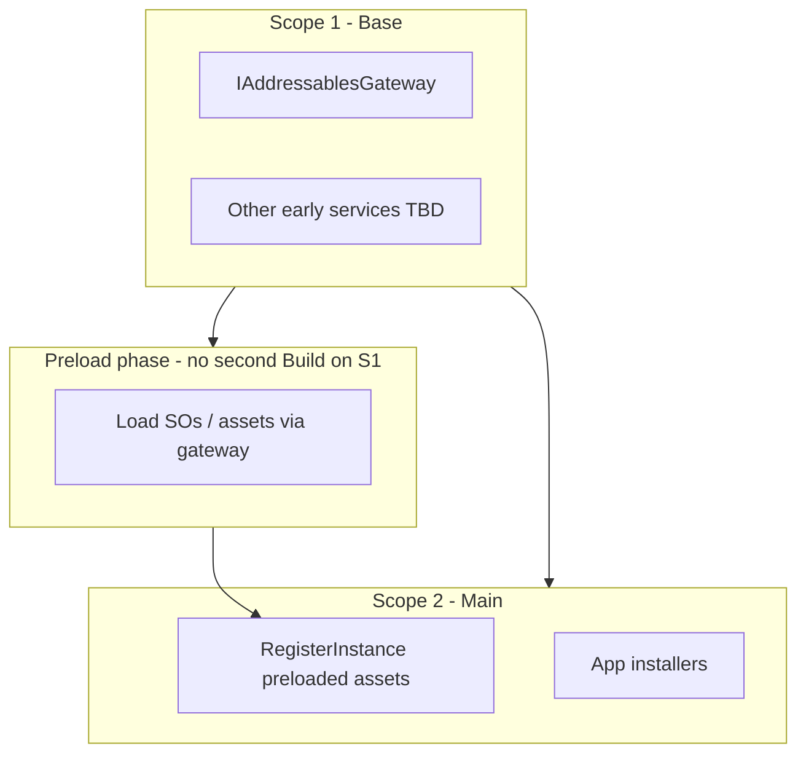

# Startup: two-scope preload (implementation outline)

This document is an **implementation outline** only—no code in the repo is required to match it until an ExecPlan adopts it.

**Related:** [Startup: initialization ordering](Startup-Initialization-Ordering.md) — dependency-derived async init graph and `IAsyncInitializationRunner`; that logic runs **once per scope** as described below.

## Goal

A **base (early) scope** for Addressables and future “very early” checks; a **main scope** for the rest of the app, with assets available after preload.

## Roles

| Scope | Working name | Responsibility |
|-------|----------------|----------------|
| **1 — Base / early** | `BaseScope`, `EarlyApplicationScope`, etc. | Minimal DI: Addressables gateway stack; **optional future** “very early” steps (environment, server flag, license check—**not** specified now). Runs **Addressables** init (catalog/runtime ready) via the same **init runner** as in [Startup-Initialization-Ordering.md](Startup-Initialization-Ordering.md). |
| **2 — Main** | `ApplicationScope`, `GameScope`, etc. | Full app installers: navigation, cloud code, UI, etc. **Registers preloaded assets** (`RegisterInstance` / facades) and all feature services. |

## High-level flow

1. **Create and configure Scope 1** (installers: Addressables only + shared early contracts).
2. **`Build()` Scope 1.**
3. **Run `IAsyncInitializationRunner` on Scope 1’s resolver** — brings gateway (and any other `IAsyncInitializable` in scope 1) up in **derived order**.
4. **Preload** content required for Scope 2:
   - Use `IAddressablesGateway` from Scope 1.
   - Load `NavigationSettings` (and any other SOs/refs) **here**.
   - Collect results in a small **DTO** or tuple (not yet in Scope 2’s container).
5. **Create Scope 2** as **child** of Scope 1 (VContainer `LifetimeScope` parent/child pattern), **or** pass Scope 1 as parent resolver depending on your exact VContainer setup.
6. **Register** preloaded instances on Scope 2’s builder (`RegisterInstance`, etc.).
7. **`Build()` Scope 2.**
8. **Run `IAsyncInitializationRunner` on Scope 2’s resolver** for all `IAsyncInitializable` types registered there.

**Rule:** Anything that **must** exist before Scope 2 `Build()` as a **concrete instance** is produced in step 4–6. **No** late registration on Scope 2 after `Build()` except what your container allows (prefer not).

## What “base scope” owns vs not

- **Owns:** Addressables **infrastructure** (gateway, client, handler), future **early checks** as small services + their installers.
- **Does not own:** Feature modules (navigation controller, cloud code, etc.) unless you intentionally keep them in Scope 1 for lifetime reasons.

## How this interacts with initialization ordering

**Initialization ordering** runs **twice**: once per scope, on **that** scope’s resolver—each graph only includes types **registered in that scope** (plus membership rules). Scope 1 graph is tiny; Scope 2 graph is the full app.

## Flow diagram (Mermaid)



## Public API (sketch)

```text
BaseLifetimeScope : LifetimeScope
  installers: Addressables only (+ future early modules)

MainLifetimeScope : LifetimeScope
  parent: BaseLifetimeScope
  installers: app modules; receives preloaded assets via installer method or context object

IStartupPhase / IEarlyStartupContributor  // optional future extension for Scope 1 beyond Addressables
```

Concrete names can follow your existing `Scaffold.*` naming.

## Future extension (Scope 1)

Add interfaces such as `IEarlyStartupCheck` with `Task VerifyAsync(CancellationToken)` and register them in Scope 1. **Order** among those can reuse the **same** `IAsyncInitializationRunner` (reflection graph) or a **tiny** sequential list if they have no DI dependencies—decision deferred; outline only.

## Summary

| Topic | Mechanism |
|-------|-----------|
| **Two scopes** | Scope 1 build → init runner → preload via gateway → Scope 2 build with `RegisterInstance` → init runner. |

This outline is ready to be turned into an ExecPlan with file paths, asmdef impact, and migration steps from `LayeredScope` / `IAsyncLayerInitializable`.
