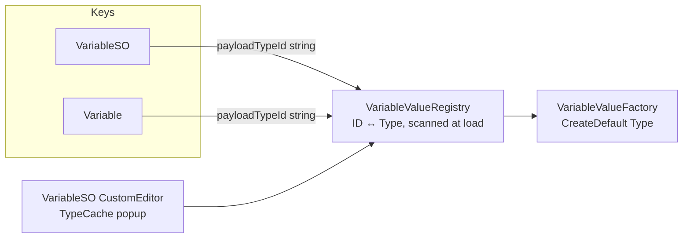

# Refactor: enum → stable-ID `VariableValue` type identity + value-type cleanup

## Goals

- Remove the closed `VariableValueType` enum and the abstract `Type` discriminator on `VariableValue`.
- Represent "what kind of payload this variable expects" as a **stable string ID** declared per concrete `VariableValue` subclass, decoupled from assembly/namespace/type renames.
- Drive authoring UI from `TypeCache.GetTypesDerivedFrom<VariableValue>()`.
- Bundle removal of unused `Min`/`Max`/`Clamped` on `FloatVariableValue` / `IntVariableValue` (touching the same files anyway). **This is an accepted behavior change**: `IntVariableValue.Combine` currently always calls `Math.Clamp(sum, Min, Max)` and `FloatVariableValue.Combine` clamps when `Clamped == true`. Audit found no production assets relying on this: `Min`/`Max`/`Clamped` are never validated at write-time, never tested, and `Hp`/`MaxHp`-style use cases are better modeled as two variables. Post-refactor `Combine` is a plain sum — no clamp, no compat shim.

## Explicitly out of scope (deferred follow-ups)

- **Combine relocation to modifiers** (`IModifier<T>` + ordering/phase). Lives in a separate ExecPlan after this lands. `VariableValue.Combine` stays as-is in this PR.
- New value types (`Vector3VariableValue`, `GameObjectVariableValue`). The system will support them after this refactor; adding them is its own task.
- **Migration**. No legacy field handling, no ordinal-to-ID mapper, no `ISerializationCallbackReceiver`, no one-shot re-save passes. Existing `.asset` files with `valueType: <int>` will break. Sample assets are re-authored by hand as part of this PR; consumers of pre-existing variable assets re-author them. Accept the breakage.

## Why stable IDs and not AssemblyQualifiedName

AQN is brittle:

- Asmdef rename or move → all serialized data breaks.
- Assembly version bump → AQN string drifts.
- Code stripping in IL2CPP builds → `Type.GetType` returns null.
- Silent fallback to `StringVariableValue` is data corruption (a Float silently becomes a String).

Stable ID via attribute decouples persistence from C# names:

```csharp
[AttributeUsage(AttributeTargets.Class, Inherited = false)]
public sealed class VariableValueIdAttribute : Attribute
{
    public string Id { get; }
    public VariableValueIdAttribute(string id) { Id = id; }
}

[VariableValueId("int")]    public sealed class IntVariableValue    : VariableValue { ... }
[VariableValueId("float")]  public sealed class FloatVariableValue  : VariableValue { ... }
[VariableValueId("bool")]   public sealed class BoolVariableValue   : VariableValue { ... }
[VariableValueId("string")] public sealed class StringVariableValue : VariableValue { ... }
```

Renames are free.

## Coupling diagram (after refactor)



Concrete `VariableValue` instances match via `GetType()`; rebase compares against `Registry.TryResolve(payloadTypeId)`.

## 1. `VariableValueRegistry` (new)

Static, lazily populated on first access. Scans `AppDomain.CurrentDomain.GetAssemblies()` for `VariableValueIdAttribute` once. Builds `Dictionary<string, Type>` and `Dictionary<Type, string>`. Detects:

- **Duplicate IDs** → throw at load (editor) / log error (runtime). Caught early.
- **Missing attribute** on a concrete `VariableValue` subclass → editor warning ("type X cannot be authored, add `[VariableValueId]`").

API:

```csharp
internal static class VariableValueRegistry
{
    public static bool TryResolve(string id, out Type type);
    public static bool TryGetId(Type type, out string id);
    public static bool Contains(Type type);
    public static IReadOnlyList<Type> AllConcreteTypes { get; }   // editor convenience
}
```

`Type.GetType` is **not used** anywhere — registry is the single resolution path. Only registry-tracked types are valid `VariableValue` payloads; types missing the attribute don't exist as far as the system is concerned.

### IL2CPP preservation

The registry relies on `AppDomain.GetAssemblies()` + `Attribute.GetCustomAttributes`. Unity's managed code stripping cannot statically detect reflection-only references, so concrete `VariableValue` subclasses can be stripped at Medium/High stripping levels in IL2CPP players. Two-part mitigation, both required:

1. **`[Preserve]` on the base class and the attribute** — `[assembly: AlwaysLinkAssembly]` on the package's runtime asmdef, plus `[Preserve]` (`UnityEngine.Scripting.PreserveAttribute`) on `VariableValue` and `VariableValueIdAttribute`.
2. **`link.xml`** under `Assets/Packages/com.scaffold.entities/Runtime/` preserving the runtime assembly fully. Pattern:
   ```xml
   <linker>
     <assembly fullname="Scaffold.Entities" preserve="all"/>
   </linker>
   ```
   This is the simplest robust answer — the package is small, full-preserve is fine. Optimizing later (per-type `[Preserve]` codegen) can replace this if/when stripping savings matter.

Validation: build an IL2CPP player with stripping level **High**, run a smoke test that resolves each registered ID via the registry. Add to the package's manual QA checklist.

## 2. `VariableValue` and value subclasses

- Drop the `Type` abstract property and `VariableValueType` enum entirely. Delete `VariableValueType.cs`.
- Drop `Min`, `Max`, `Clamped` from `FloatVariableValue`. `Combine` becomes a plain sum (no clamp).
- Drop `Min`, `Max` from `IntVariableValue`. `Combine` becomes a plain sum (no `Math.Clamp`).
- `Combine` signature unchanged — combine-on-modifier is the next plan.

```csharp
[Serializable]
public abstract class VariableValue
{
    public abstract VariableValue Combine(IReadOnlyList<VariableValue> contributions);
}

[VariableValueId("float")]
[Serializable]
public sealed class FloatVariableValue : VariableValue, IVariableValue<float>
{
    [SerializeField] private float value;
    public float Value { get => value; set => this.value = value; }
    public float Get() => Value;

    public override VariableValue Combine(IReadOnlyList<VariableValue> contributions)
    {
        float sum = Value;
        for (int i = 0; i < contributions.Count; i++)
            if (contributions[i] is FloatVariableValue f) sum += f.Value;
        return new FloatVariableValue { Value = sum };
    }
}
```

(Int/Bool/String mirror this pattern — Bool last-write-wins, String concatenation, both unchanged in semantics.)

## 3. `VariableValueFactory`

Validation goes through the registry, not reflection on the type hierarchy. If a type isn't in the registry, it isn't a usable `VariableValue` — the registry already enforces "concrete subclass with `[VariableValueId]`", so checking membership is equivalent to (and tighter than) `IsAssignableFrom + !IsAbstract`.

- `CreateDefault(Type payloadType)` — must be present in `VariableValueRegistry`, otherwise throws. **No silent fallback.**
- `CreateDefault(string payloadTypeId)` — resolves via registry, then delegates. Unknown ID = throws.
- `From<T>(T value)` — unchanged shape.

```csharp
internal static VariableValue CreateDefault(Type payloadType)
{
    if (payloadType == null || !VariableValueRegistry.Contains(payloadType))
    {
        throw new ArgumentException(
            $"Type {payloadType} is not a registered VariableValue. " +
            $"Concrete subclasses must declare [VariableValueId(\"...\")].");
    }
    return (VariableValue)Activator.CreateInstance(payloadType);
}

internal static VariableValue CreateDefault(string payloadTypeId)
{
    if (!VariableValueRegistry.TryResolve(payloadTypeId, out Type t))
    {
        throw new ArgumentException(
            $"Unknown VariableValue payload id: '{payloadTypeId}'.");
    }
    return CreateDefault(t);
}
```

Rebase helpers in `VariableEntry` / `EntityModifierEntry` use the same path:

```csharp
if (!VariableValueRegistry.TryResolve(key.PayloadTypeId, out Type expected))
{
    // unknown ID — log + skip rebase, do not coerce
    return;
}
if (baseValue != null && baseValue.GetType() == expected) return;
baseValue = VariableValueFactory.CreateDefault(expected);
```

## 4. Serialized identity on keys

`Variable` **stays a record**. Its second positional parameter changes from `VariableValueType Type` to `string PayloadTypeId`:

```csharp
public record Variable(string Key, string PayloadTypeId);
```

Record value-equality already compares both fields as strings — no manual `Equals`/`GetHashCode` needed. Used safely as a `Dictionary<Variable, ...>` key in `VariableModifierHandler`.

`VariableSO` carries the same string field:

```csharp
public sealed class VariableSO : ScriptableObject
{
    [SerializeField] private string key = "";
    [SerializeField] private string payloadTypeId = "string";

    public string Key => key;
    public string PayloadTypeId => payloadTypeId;

    // implicit conversion / explicit ToVariable() builds: new Variable(key, payloadTypeId)
}
```

No `ISerializationCallbackReceiver`, no cached `Type`. Registry resolution is a dictionary lookup — cheap enough for the hot paths that need it. If a hot path ever profiles as a problem, add caching then.

Audit/grep for callers that read the old `Type` (enum) or `VariableValueType` and update them to `PayloadTypeId` (string) — straight rename.

## 5. Editor — TypeCache-driven authoring

New `Editor/VariableSOEditor.cs`:

```csharp
[CustomEditor(typeof(VariableSO))]
public sealed class VariableSOEditor : Editor
{
    private static Type[] cachedTypes;
    private static GUIContent[] cachedLabels;

    private static void EnsureTypeCache()
    {
        if (cachedTypes != null) return;
        cachedTypes = TypeCache.GetTypesDerivedFrom<VariableValue>()
            .Where(t => !t.IsAbstract && !t.IsGenericTypeDefinition)
            .Where(t => VariableValueRegistry.Contains(t))
            .OrderBy(t => t.Name)
            .ToArray();
        cachedLabels = cachedTypes.Select(t => new GUIContent(t.Name)).ToArray();
    }

    public override void OnInspectorGUI()
    {
        EnsureTypeCache();
        SerializedProperty idProp = serializedObject.FindProperty("payloadTypeId");
        // popup index <-> id; write ID via VariableValueRegistry.TryGetId
        // ...
        serializedObject.ApplyModifiedProperties();
    }
}
```

Filtering rules:

- `!IsAbstract` — skip the base.
- `!IsGenericTypeDefinition` — skip open generics.
- `VariableValueRegistry.Contains(t)` — skip concrete subclasses that lack `[VariableValueId]` (registry already filters them out, double-checked here for clarity).

Refactor `Editor/VariableKeySoField.cs`:

- Replace any `enumValueIndex` / ordinal wiring with `payloadTypeId` string assignment.
- `RebaseManagedReferencePayloadForVariableSo`: resolve default via registry from the SO's `PayloadTypeId`; on unknown ID, log + skip rebase rather than coerce.

`TypeCache` is editor-only and stays under the `Editor/` asmdef — already enforced by package layout.

## 6. Equality and dictionary-key stability

`VariableModifierHandler` keys a `Dictionary<Variable, ...>` on `Variable`. After this refactor:

- `Variable` is a record with `(string Key, string PayloadTypeId)` — synthesized value equality compares both strings. No manual override needed.
- **Never** compare resolved `Type` instances anywhere — stick to the ID string for hot paths.

## 7. Tests

- `EntityInstanceTests`, `VariableBagTests`: replace `CreateVariableSo(..., VariableValueType.Float)` with a test helper `SetPayloadType(this VariableSO so, Type t)` that writes the ID string + sets dirty.
- `EntityModifierEntryAssetEditorTests`: drop `FindProperty("valueType").enumValueIndex`; use the helper or set `payloadTypeId` directly.
- Add a registry test: duplicate `[VariableValueId("foo")]` triggers a clear error (use a private test-only assembly or a guard hook).
- Add a factory test: `CreateDefault` of an unregistered type throws.

## 8. Documentation

Update `Assets/Packages/com.scaffold.entities/README.md`:

- Payload type is now a concrete `VariableValue` subclass identified by stable ID via `[VariableValueId]`.
- Authoring uses the type-picker driven by `TypeCache`.
- How to add a new type (subclass + attribute + parameterless ctor).
- **Breaking change note**: existing `valueType: <int>` assets will not load; re-author them.

## 9. Quality gate

- `validate-changes.ps1` per `AGENTS.md`.
- Unity EditMode tests: `com.scaffold.entities` package.
- Manual: re-author `Health.asset` (and any other sample SOs) under the new shape; confirm inspector shows the type-picker, save, confirm YAML now contains `payloadTypeId: float` and no `valueType`.

## Risks and decisions

- **Unknown ID at runtime** — fail loud (editor: error in `OnValidate` / inspector banner; runtime: log error and skip rebase). Never silently coerce.
- **Duplicate `[VariableValueId]`** — registry throws on init; surfaces as a build error in editor, log + degraded behavior in player.
- **Activator constraint** — concrete `VariableValue` subclasses must have a public parameterless ctor. Documented in the README "adding a new type" section.
- **Breaking change (assets)** — existing serialized variable assets break. Accepted, no migration path. Sample assets in this PR are re-authored to demonstrate the new shape; downstream consumers re-author theirs.
- **Breaking change (clamp behavior)** — `IntVariableValue.Combine` no longer clamps; `FloatVariableValue.Combine` no longer respects `Clamped`. Accepted per audit; no compat shim. Documented in the README's breaking-change note alongside the asset breakage.
- **IL2CPP stripping** — covered by `link.xml` + `[Preserve]` on base class/attribute (see §1 IL2CPP preservation). Validated by an IL2CPP-High smoke build.

Scope is **package-internal**: all `VariableValueType` references live under `com.scaffold.entities`; public surface change is bounded to `Variable`, `VariableSO`, removal of the enum, and removal of `VariableValue.Type` / `Min` / `Max` / `Clamped`.
