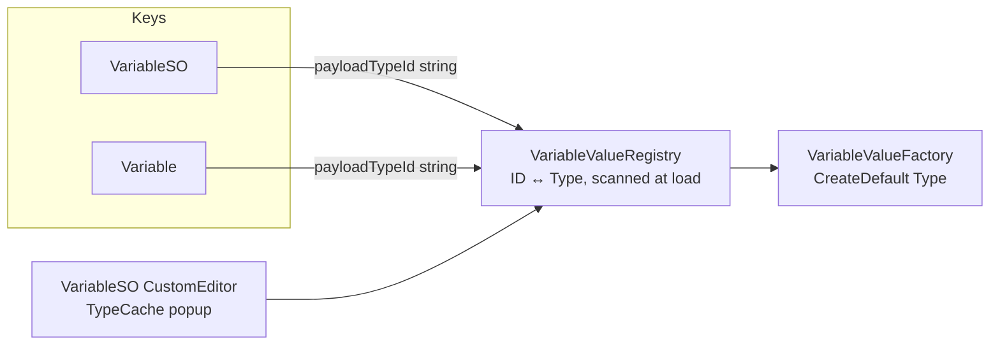

# Refactor: enum → stable-ID `VariableValue` type identity + value-type cleanup

## Goals

- Remove the closed `VariableValueType` enum and the abstract `Type` discriminator on `VariableValue`.
- Represent "what kind of payload this variable expects" as a **stable string ID** declared per concrete `VariableValue` subclass, decoupled from assembly/namespace/type renames.
- Drive authoring UI from `TypeCache.GetTypesDerivedFrom<VariableValue>()`.
- Bundle removal of unused `Min`/`Max`/`Clamped` on `FloatVariableValue` / `IntVariableValue` (touching the same files anyway).
- Migrate existing YAML assets from the legacy `valueType: <int>` field with no manual user action.

## Explicitly out of scope (deferred follow-ups)

- **Combine relocation to modifiers** (`IModifier<T>` + ordering/phase). Lives in a separate ExecPlan after this lands. `VariableValue.Combine` stays as-is in this PR.
- New value types (`Vector3VariableValue`, `GameObjectVariableValue`). The system will support them after this refactor; adding them is its own task.

## Why stable IDs and not AssemblyQualifiedName

AQN is brittle:

- Asmdef rename or move → all serialized data breaks.
- Assembly version bump → AQN string drifts.
- Code stripping in IL2CPP builds → `Type.GetType` returns null.
- Silent fallback to `StringVariableValue` is data corruption (a Float silently becomes a String).

Stable ID via attribute decouples persistence from C# names:

```csharp
[AttributeUsage(AttributeTargets.Class, Inherited = false)]
public sealed class VariableValueIdAttribute : Attribute
{
    public string Id { get; }
    public VariableValueIdAttribute(string id) { Id = id; }
}

[VariableValueId("int")]    public sealed class IntVariableValue    : VariableValue { ... }
[VariableValueId("float")]  public sealed class FloatVariableValue  : VariableValue { ... }
[VariableValueId("bool")]   public sealed class BoolVariableValue   : VariableValue { ... }
[VariableValueId("string")] public sealed class StringVariableValue : VariableValue { ... }
```

Renames are free. Migration ordinals map directly: `0→"string"`, `1→"float"`, `2→"int"`, `3→"bool"`.

## Coupling diagram (after refactor)



Concrete `VariableValue` instances match via `GetType()`; rebase compares against `Registry.Resolve(payloadTypeId)`.

## 1. `VariableValueRegistry` (new)

Static, lazily populated on first access. Scans `AppDomain.CurrentDomain.GetAssemblies()` for `VariableValueIdAttribute` once. Builds `Dictionary<string, Type>` and `Dictionary<Type, string>`. Detects:

- **Duplicate IDs** → throw at load (editor) / log error (runtime). Caught early.
- **Missing attribute** on a concrete `VariableValue` subclass → editor warning ("type X cannot be authored, add `[VariableValueId]`").

API:

```csharp
internal static class VariableValueRegistry
{
    public static bool TryResolve(string id, out Type type);
    public static bool TryGetId(Type type, out string id);
    public static IReadOnlyList<Type> AllConcreteTypes { get; }   // editor convenience
}
```

`Type.GetType` is **not used** anywhere — registry is the single resolution path.

## 2. `VariableValue` and value subclasses

- Drop the `Type` abstract property and `VariableValueType` enum entirely. Delete `VariableValueType.cs`.
- Drop `Min`, `Max`, `Clamped` from `FloatVariableValue`. `Combine` becomes a plain sum (no clamp).
- Drop `Min`, `Max` from `IntVariableValue`. `Combine` becomes a plain sum (no `Math.Clamp`).
- `Combine` signature unchanged — combine-on-modifier is the next plan.

```csharp
[Serializable]
public abstract class VariableValue
{
    public abstract VariableValue Combine(IReadOnlyList<VariableValue> contributions);
}

[VariableValueId("float")]
[Serializable]
public sealed class FloatVariableValue : VariableValue, IVariableValue<float>
{
    [SerializeField] private float value;
    public float Value { get => value; set => this.value = value; }
    public float Get() => Value;

    public override VariableValue Combine(IReadOnlyList<VariableValue> contributions)
    {
        float sum = Value;
        for (int i = 0; i < contributions.Count; i++)
            if (contributions[i] is FloatVariableValue f) sum += f.Value;
        return new FloatVariableValue { Value = sum };
    }
}
```

(Int/Bool/String mirror this pattern — Bool last-write-wins, String concatenation, both unchanged in semantics.)

## 3. `VariableValueFactory`

- `CreateDefault(Type payloadType)` — validates `payloadType` is concrete and assignable to `VariableValue`, otherwise throws (editor) / logs and returns null (runtime). **No silent String fallback.**
- `CreateDefault(string payloadTypeId)` — resolves via `VariableValueRegistry`, then delegates. Unknown ID = error.
- `From<T>(T value)` — unchanged shape.

```csharp
internal static VariableValue CreateDefault(Type payloadType)
{
    if (payloadType == null
        || payloadType.IsAbstract
        || !typeof(VariableValue).IsAssignableFrom(payloadType))
    {
        throw new ArgumentException(
            $"Invalid VariableValue payload type: {payloadType}");
    }
    return (VariableValue)Activator.CreateInstance(payloadType);
}
```

## 4. Serialized identity on keys

Audit first: **is `Variable` ever serialized to disk independently of `VariableSO`?** Search for `[SerializeField] Variable` / `[SerializeReference] Variable` outside `VariableSO`. If no, **skip migration on `Variable`** — keep it as a record with manual `Equals`/`GetHashCode` over `(Key, payloadTypeId)`. If yes, mirror the migration on it.

`VariableSO`:

```csharp
public sealed class VariableSO : ScriptableObject, ISerializationCallbackReceiver
{
    [SerializeField] private string key = "";
    [SerializeField] private string payloadTypeId = "string";

    [NonSerialized] private Type cachedType;
    [NonSerialized] private bool cacheValid;

    public string PayloadTypeId => payloadTypeId;

    public Type PayloadType
    {
        get
        {
            if (!cacheValid)
            {
                VariableValueRegistry.TryResolve(payloadTypeId, out cachedType);
                cacheValid = true;
            }
            return cachedType; // may be null on unknown ID — caller decides
        }
    }

    public void OnBeforeSerialize() { }
    public void OnAfterDeserialize() { cacheValid = false; /* + migration, see §5 */ }
}
```

## 5. Migration from `valueType: <int>` ordinals

Approach: transient legacy int field, consumed once, never re-serialized.

```csharp
// Inside VariableSO
[SerializeField, FormerlySerializedAs("valueType")]
private int legacyValueType = -1;

public void OnAfterDeserialize()
{
    if (legacyValueType >= 0)
    {
        payloadTypeId = LegacyOrdinalToId(legacyValueType); // 0=string,1=float,2=int,3=bool
        legacyValueType = -1; // sentinel; cleaned up by re-save pass
    }
    cacheValid = false;
}
```

Then run a one-shot editor migrator (menu item or `[InitializeOnLoad]` guarded by version key in `EditorPrefs`):

1. `AssetDatabase.FindAssets("t:VariableSO")`
2. Load each, mark dirty, save.
3. After saving, drop the `legacyValueType` field in a follow-up commit (Unity gracefully handles missing fields on next deserialize).

This avoids `legacyValueType: -1` lingering in YAML forever.

Sample `.asset` files under `Samples/` should be re-saved by hand (or via the same migrator) so the repo doesn't carry mixed-shape examples.

## 6. Editor — TypeCache-driven authoring

New `Editor/VariableSOEditor.cs`:

```csharp
[CustomEditor(typeof(VariableSO))]
public sealed class VariableSOEditor : Editor
{
    private static Type[] cachedTypes;
    private static GUIContent[] cachedLabels;

    private static void EnsureTypeCache()
    {
        if (cachedTypes != null) return;
        cachedTypes = TypeCache.GetTypesDerivedFrom<VariableValue>()
            .Where(t => !t.IsAbstract && !t.IsGenericTypeDefinition)
            .OrderBy(t => t.Name)
            .ToArray();
        cachedLabels = cachedTypes.Select(t => new GUIContent(t.Name)).ToArray();
    }

    public override void OnInspectorGUI()
    {
        EnsureTypeCache();
        SerializedProperty idProp = serializedObject.FindProperty("payloadTypeId");
        // popup index <-> id; write ID via VariableValueRegistry.TryGetId
        // ...
        serializedObject.ApplyModifiedProperties();
    }
}
```

Filtering rules:

- `!IsAbstract` — skip the base.
- `!IsGenericTypeDefinition` — skip open generics.
- (Optional) skip types missing `VariableValueIdAttribute` and surface a HelpBox listing them.

Refactor `Editor/VariableKeySoField.cs`:

- Replace any `enumValueIndex` / ordinal wiring with `payloadTypeId` string assignment.
- `RebaseManagedReferencePayloadForVariableSo`: resolve default via `selectedSo.PayloadType` from registry; on null, log + skip rebase rather than coerce.

`TypeCache` is editor-only and stays under the `Editor/` asmdef — already enforced by package layout.

## 7. Equality and dictionary-key stability

`VariableModifierHandler` keys a `Dictionary<Variable, ...>` on `Variable`. After this refactor:

- `Variable.Equals` compares `(Key, payloadTypeId)` — both strings.
- `GetHashCode` combines the same two strings.
- **Never** compare resolved `Type` instances or AQN — stick to the ID string for hot paths.

If `Variable` stays a record, override the synthesized equality manually (records use all properties, but if `payloadTypeId` is the only non-Key state, default behavior is fine — verify).

If `Variable` converts to a class, **grep for**:

- `Variable with { ... }` — must be rewritten as constructor calls.
- `is Variable("x", _)` — pattern matches break.
- Any LINQ `.Distinct()` / `.GroupBy()` over `Variable` — relies on equality.

## 8. Tests

- `EntityInstanceTests`, `VariableBagTests`: replace `CreateVariableSo(..., VariableValueType.Float)` with a test helper `SetPayloadType(this VariableSO so, Type t)` that writes the ID string + sets dirty.
- `EntityModifierEntryAssetEditorTests`: drop `FindProperty("valueType").enumValueIndex`; use the helper or set `payloadTypeId` directly.
- Add a new test: round-trip a legacy YAML SO (with `valueType: 1`) through deserialize → assert `PayloadType == typeof(FloatVariableValue)` and `legacyValueType == -1`.
- Add a registry test: duplicate `[VariableValueId("foo")]` triggers a clear error (use a private test-only assembly or a guard hook).

## 9. Documentation

Update `Assets/Packages/com.scaffold.entities/README.md`:

- Payload type is now a concrete `VariableValue` subclass identified by stable ID via `[VariableValueId]`.
- Authoring uses the type-picker driven by `TypeCache`.
- How to add a new type (subclass + attribute + parameterless ctor).
- Migration is automatic on first asset load; the bundled migrator clears legacy fields.

## 10. Quality gate

- `validate-changes.ps1` per `AGENTS.md`.
- Unity EditMode tests: `com.scaffold.entities` package.
- Manual: open a Unity scene with an existing `Health.asset`, confirm inspector shows the new type-picker preselected to `FloatVariableValue`, save, confirm YAML now contains `payloadTypeId: float` and no `valueType`.

## Risks and decisions

- **Unknown ID at runtime** — fail loud (editor: error in `OnValidate` / inspector banner; runtime: log error and skip rebase). Never silently coerce.
- **Duplicate `[VariableValueId]`** — registry throws on init; surfaces as a build error in editor, log + degraded behavior in player.
- **Activator constraint** — concrete `VariableValue` subclasses must have a public parameterless ctor. Documented in the README "adding a new type" section.
- **Variable record vs class** — decided by the §4 audit. If `Variable` is runtime-only, keep it a record and avoid the migration noise. Default assumption: keep it a record.
- **Sample assets in repo** — re-saved as part of this PR so review diff shows the new shape side-by-side with code changes.

Scope is **package-internal**: all `VariableValueType` references live under `com.scaffold.entities`; public surface change is bounded to `Variable`, `VariableSO`, removal of the enum, and removal of `VariableValue.Type` / `Min` / `Max` / `Clamped`.
