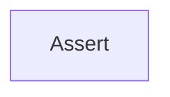

<!-- hash: 1f383ea6d556f8128b33b8170d9e6427 -->
# Assert Documentation

This document details the purpose and relations of the components in `/Utility/Assert`.

## Component Overview

### `Assert` (class)
- **Description**: Provides assertion utilities for validating conditions and values. The main goal is to enforce invariants and throw standard exceptions on failure.
- **Namespace**: `Utility.Assert`
- **Methods**: `IsTrue`, `IsNotEmpty`

## Dependency & Behavior Schema

[Back to Parent](../UtilityRead.md)
