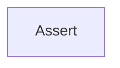

<!-- hash: 0c505e43f420fd4701daa4678ff39a5c -->
# Assert Documentation

This document details the purpose and relations of the components in `/Utility/Assert`.

## Component Overview

### `Assert` (class)
- **Description**: Provides validation methods to ensure conditions such as checking for null, emptiness, or boolean truth values, throwing appropriate exceptions if assertions fail.
- **Namespace**: `Utility.Assert`
- **Methods**: `IsNotEmpty`, `IsTrue`

## Dependency & Behavior Schema

[Back to Parent](../UtilityRead.md)
