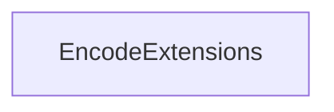

<!-- hash: 9df7437f16abd885ed358f7859cbf347 -->
# Encode Documentation

This document details the purpose and relations of the components in `/Utility/Encode`.

## Component Overview

### `EncodeExtensions` (class)
- **Description**: Provides extension methods and utilities for data encoding and validation. The main goal is to offer standardized functions for sanitizing keys and validating formats.
- **Namespace**: `Utility.Encode`
- **Methods**: `SanitizeKey`, `IsValidEmail`, `DesanitizeKey`

## Dependency & Behavior Schema

[Back to Parent](../UtilityRead.md)
