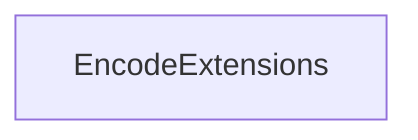

<!-- hash: ea2b936ade8373be64e16e528f4b1285 -->
# Encode Documentation

This document details the purpose and relations of the components in `/Utility/Encode`.

## Component Overview

### `EncodeExtensions` (class)
- **Description**: Contains utility methods for validating email addresses and encoding or decoding strings into URL-safe formats.
- **Namespace**: `Utility.Encode`
- **Methods**: `DesanitizeKey`, `SanitizeKey`, `IsValidEmail`

## Dependency & Behavior Schema

[Back to Parent](../UtilityRead.md)
