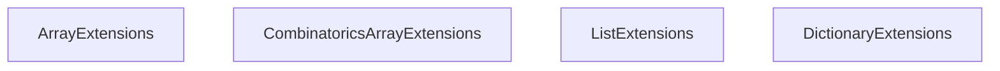

<!-- hash: ac3e2df92c19e4f4470bdff47698ca28 -->
# Enumerable Documentation

This document details the purpose and relations of the components in `/Utility/Enumerable`.

## Component Overview

### `ArrayExtensions` (class)
- **Description**: Provides extension methods for common array and enumerable operations. The main goal is to ease functional array mutations and aggregate logic evaluations.
- **Namespace**: `Utility.Array`
- **Methods**: `AnyTrue`, `AllTrue`

### `CombinatoricsArrayExtensions` (class)
- **Description**: Provides extension methods for generating combinations (power sets) from generic enumerables. The main goal is to efficiently compute mathematical combinations iteratively.
- **Namespace**: `Utility.Combinatorics`

### `ListExtensions` (class)
- **Description**: Provides extension methods for generic List and IList collections. The main goal is to simplify operations like shuffling, splitting, and set comparison.
- **Namespace**: `Utility.List`

### `DictionaryExtensions` (class)
- **Description**: Provides extension methods for manipulating and querying dictionary structures. The main goal is to simplify deep dictionary comparisons and list-based value aggregations.
- **Namespace**: `Utility.Dictionary`
- **Methods**: `AreDictionariesEqual`, `AreValuesEqual`

## Dependency & Behavior Schema

[Back to Parent](../UtilityRead.md)
