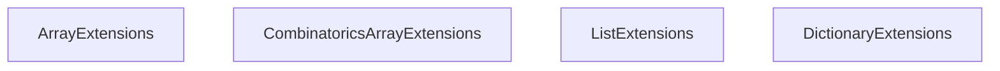

<!-- hash: 0bdfaf9a40dddddf52b1eb05763ba1db -->
# Enumerable Documentation

This document details the purpose and relations of the components in `/Utility/Enumerable`.

## Component Overview

### `ArrayExtensions` (class)
- **Description**: Provides extension methods for arrays to enable adding, removing, or checking for elements, and evaluating boolean collections.
- **Namespace**: `Utility.Array`
- **Methods**: `AllTrue`, `AnyTrue`

### `CombinatoricsArrayExtensions` (class)
- **Description**: Offers methods to generate combinations or power sets from collections, returning the results as enumerables or jagged arrays.
- **Namespace**: `Utility.Combinatorics`

### `ListExtensions` (class)
- **Description**: Contains extension methods for lists to facilitate shuffling, element comparison, and checking for null or empty states.
- **Namespace**: `Utility.List`

### `DictionaryExtensions` (class)
- **Description**: Provides utility methods for comparing, merging, and safely manipulating dictionaries, especially those containing list values.
- **Namespace**: `Utility.Dictionary`
- **Methods**: `AreValuesEqual`, `AreDictionariesEqual`

## Dependency & Behavior Schema

[Back to Parent](../UtilityRead.md)
