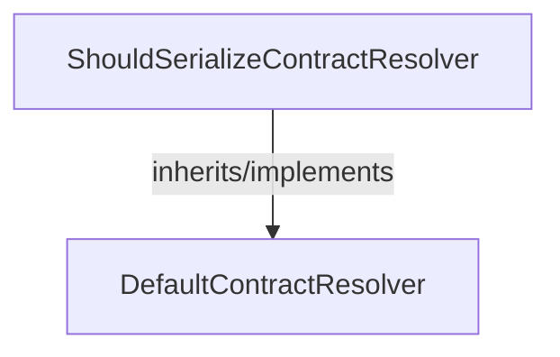

<!-- hash: ff10e729e8bd22b899a19f83b6e236b6 -->
# Json Documentation

This document details the purpose and relations of the components in `/Utility/Json`.

## Component Overview

### `ShouldSerializeContractResolver` (class)
- **Description**: A custom JSON contract resolver that excludes empty strings, empty collections, and default value types from serialization.
- **Namespace**: `Utility.Json`
- **Inherits/Implements**: `DefaultContractResolver`
- **Methods**: `IsValueOrNullableValueType`, `GetDefaultValue`, `CreateProperty`

## Dependency & Behavior Schema

[Back to Parent](../UtilityRead.md)
