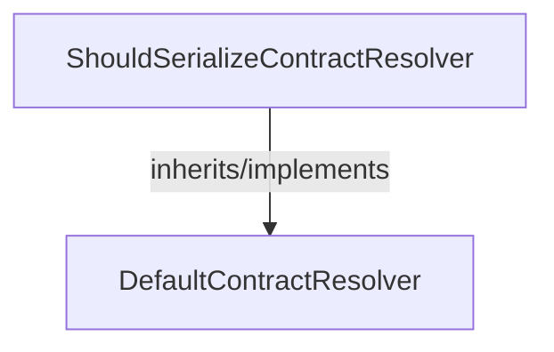

<!-- hash: ce35bf5d67669a2b58aa5a19f6d8d172 -->
# Json Documentation

This document details the purpose and relations of the components in `/Utility/Json`.

## Component Overview

### `ShouldSerializeContractResolver` (class)
- **Description**: Custom JSON contract resolver for Newtonsoft JSON serialization. The main goal is to ignore properties that have default, empty, or null values during serialization to shrink payloads.
- **Namespace**: `Utility.Json`
- **Inherits/Implements**: `DefaultContractResolver`
- **Properties**: `Instance`
- **Methods**: `GetDefaultValue`, `CreateProperty`, `IsValueOrNullableValueType`

## Dependency & Behavior Schema

[Back to Parent](../UtilityRead.md)
